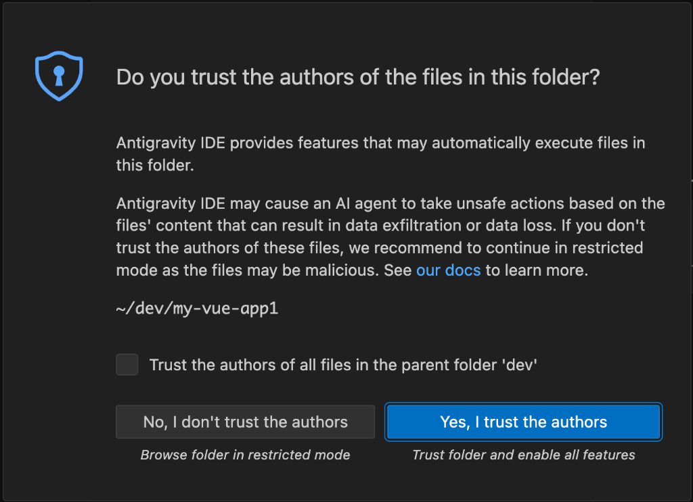
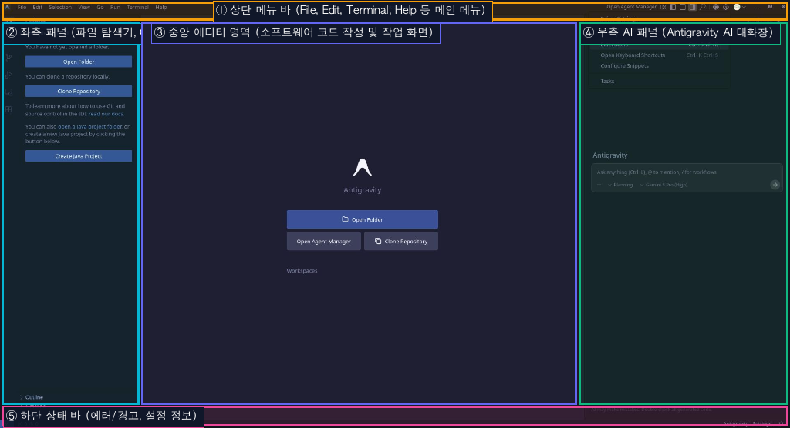
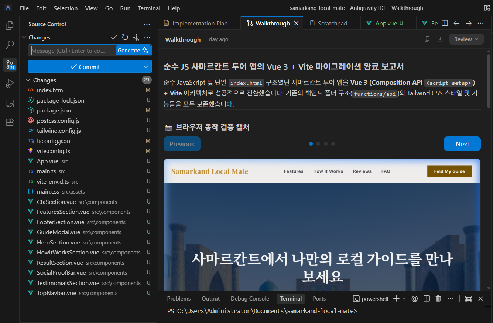
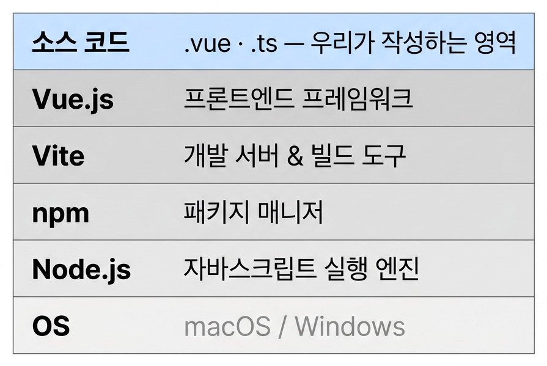

# 제1장: 온라인 스튜디오를 넘어 — Antigravity IDE와 로컬 개발 환경

> 🎉 이 장의 작은 성공: Antigravity IDE에 1권에서 만든 원본 앱이 열리고, AI가 Node.js 환경 점검까지 마쳐서 다음 장의 마이그레이션을 위한 발사대가 완성된다!

## 1. 왜 다시 로컬 개발 환경인가?

1권(기초편)의 부록에서 우리는 '로컬 개발 환경'의 필요성에 대해 짧게 맛보았습니다. 온라인 AI 스튜디오(Stitch 등)는 클릭 한 번에 눈앞에 결과물을 띄워주는 마법 같은 도구였지만, 진짜 상용 서비스를 만들기에는 다음과 같은 뚜렷한 한계가 존재했습니다.

- **프로젝트 규모의 한계**: 파일이 수십 개로 늘어나고 폴더 구조가 복잡해지면, 하나의 웹 화면 안에서 모든 것을 관리하는 온라인 스튜디오는 이를 감당하기 어렵습니다.
- **외부 도구와의 연동**: Stripe 결제, 데이터베이스(D1), 다국어 처리 등 다양한 외부 라이브러리를 자유롭게 설치하고 엮으려면 내 컴퓨터(로컬)의 터미널 제어권이 필수적입니다.
- **성능과 자유도**: 온라인 플랫폼의 제한된 클라우드 컨테이너 환경에서는 대규모 빌드 시 브라우저 렌더링 지연이나 메모리 초과가 발생할 수 있습니다. 항상 인터넷 연결이 필요한 온라인이라는 것 자체도 제약이며, 클라우드 제약에 의존하지 않고 내 컴퓨터의 자원을 100% 활용하며, 고도화된 아키텍처(SSR, 커스텀 Vite 플러그인, 보안 프록시 등)의 개발 환경을 입맛대로 세팅할 수 있는 자유도가 있어야 합니다.


**💡 개념 잡기: 라이브러리(Library)란?**

**라이브러리(Library)**&#xB294; 자주 쓰이는 특정 기능(결제, 날짜 계산, 애니메이션 등)을 다른 개발자들이 미리 만들어 둔 **'재사용 가능한 코드 부품 모음'**&#xC785;니다.

도서관(Library)에서 필요한 책을 찾아 읽듯, 복잡한 기능을 처음부터 다 직접 만들 필요 없이 잘 완성된 코드 부품을 가져와 내 앱에 결합하여 사용합니다.



**온라인 스튜디오는 '초고속 3D 프린터', 로컬 IDE는 '정밀 제조 공장'** 아이디어를 눈앞에 즉시 출력해 검증하는 데는 온라인 스튜디오만 한 혁신이 없습니다. 하지만 실제 도로를 달릴 양산형 자동차를 만들려면 엔진을 튜닝하고 안전장치를 결합하는 독립된 제조 공장(로컬 환경)으로 넘어가야 합니다.


## 2. 수많은 AI IDE 중, 왜 Antigravity인가?

로컬 환경의 중요성을 알았다면, 다음 질문은 "어떤 도구를 쓸 것인가"입니다. 요즘 개발자들 사이에서는 Cursor나 VSCode + GitHub Copilot 같은 AI 도우미가 탑재된 IDE가 대세로 자리 잡고 있습니다. 하지만 이 책에서는 **Antigravity IDE**를 핵심 도구로 선택했습니다. 갑자기 이 도구가 튀어나온 배경은 무엇일까요?


### 1권 구글 생태계와의 완벽한 연속성

1권에서 우리는 Google Stitch로 디자인을 뽑고, Gemini API로 맞춤형 가이드를 생성했습니다. 시장에 다른 선택지가 있음에도 **왜 굳이 Antigravity IDE여야 할까요?** 개발자 입장에서 가장 체감되는 현실적인 이유는 바로 **'구글 생태계의 압도적인 비용 효율성(가성비)'**과 **'1권과의 완벽한 빌드 파이프라인'**입니다.

- ✅ **1권과 연결되는 '구글 스마트 파이프라인'** : 타사 툴을 쓰면 1권에서 작업한 AI studion가 생성한 코드들에 대해 다시 재학습하는 과정이 필요합니다. 하지만 Antigravity IDE는 같은 구글 코어 엔진을 공유하므로 **AI Studio 파일과 가이드라인을 변환 과정 없이 그대로 이어받습니다.** 프로젝트를 여는 순간, 내장 AI가 우리가 1권에서 의도한 디자인 구조와 개발 방향을 백그라운드에서 이미 완벽하게 인지한 상태로 시작합니다.
- **✅ 지갑이 가벼운 개발자를 위한 압도적인 가성비 (무료 토큰 혜택)**: 타사 AI IDE들은 한 달에 몇십 번만 진지하게 코딩해도 금방 무료 쿼리가 끝나고, 결국 매달 20달러 이상의 비싼 구독료를 요구합니다. 반면 Antigravity IDE는 구글 생태계의 인프라를 등에 업고 **비교가 안 될 정도로 여유롭고 풍부한 무료 토큰(API 쿼리)을 기본 제공**합니다. 결제창 앞에서 머뭇거릴 필요 없이, 상용 서비스를 완성할 때까지 비용 부담 없이 대규모 코드를 AI와 주고받을 수 있습니다.

### 차세대 에이전틱(Agentic) AI로 나아가는 디딤돌

구글 딥마인드(Google DeepMind) 팀은 단순한 코드 추천을 넘어, 요즘 트랜드인 AI가 스스로 계획하고 실행하는 **'에이전트(Agent) 기반 코딩'** 비전을 계속 생태계를 확장해 나아가고 있습니다. (이러한 완전한 자율성은 **Antigravity 2.0**에서 본격적으로 시작되었고, 참고로 이 책의 다음 편인 마스터편에선 그 에이전트 기반한 개발을 다룰 예정입니다.) 이 책에서 다루는 Antigravity IDE는 그 거대한 비전을 향한 첫걸음입니다. 여기서 AI와 협업하는 방식을 제대로 익혀두면, 다가올 완전한 에이전틱 AI 시대에도 당황하지 않고 AI를 지휘할 수 있습니다.

### 첫걸음: Antigravity IDE 설치 및 준비하기

이론을 알았다면 이제 Antigravity IDE를 내 컴퓨터에 세팅할 차례입니다.



**공식 사이트 다운로드 및 설치**

- [Antigravity 공식 웹사이트](https://antigravity.google.com)에 접속하여 본인의 OS(macOS 또는 Windows)용 설치 파일을 다운로드합니다.
- macOS는 `.dmg` 파일을 열어 `Applications` 폴더에 넣고, Windows는 `.exe` 파일을 실행해 지시에 따라 설치를 마칩니다.
  


**구글 계정 로그인 & AI 엔진 준비**

- Antigravity IDE를 실행한 뒤, 1권에서 사용했던 구글 계정으로 로그인합니다.
- 오른쪽 Side Panel의 AI Chat 창이 활성화되며 Gemini 모델 기반의 AI 페어 프로그래머가 작동 대기 상태가 됩니다.
  


**Git 설치: 1권 코드를 가져오기 위한 첫 번째 준비**

1권에서 Google AI Studio의 온라인 환경에서 작업한 코드는 내 컴퓨터 어딘가에 저장된 것이 아니라 **GitHub 레포지토리**에만 존재합니다. 이 코드를 내 컴퓨터로 '복제(Clone)'해서 가져오려면 **Git**이 먼저 설치되어 있어야 합니다.


**💡 1권에서는 Git을 설치하라는 말이 없었는데요?**

맞습니다. 1권에서 사용한 'Google AI Studio'는 인터넷 브라우저 안에서 동작하는 **온라인 클라우드 IDE**였습니다. 코드가 이미 구글의 서버(클라우드) 위에 존재했기 때문에, 그 서버에 내장된 Git이 알아서 GitHub과 소통해주었습니다.

하지만 2권부터는 **내 컴퓨터(로컬) 환경**에서 작업하므로, 내 하드디스크에 Git 프로그램을 직접 설치해야 GitHub과 연결할 수 있습니다.


1. **설치 확인**: Antigravity IDE 상단 메뉴의 `Terminal` → `New Terminal`을 열고 `git -v`를 입력해 보세요. `git version 2.x.x`처럼 버전이 출력되면 이미 설치된 것입니다. `command not found` 에러가 나오면 아래 단계로 설치합니다.
2. **다운로드 및 설치**:
   - **Windows**: [Git 공식 홈페이지(git-scm.com)](https://git-scm.com/download/win)에서 64-bit 버전을 다운로드하고, 기본 설정(계속 'Next' 클릭)으로 설치를 완료합니다.
     (설치 중 **"Adjusting your PATH environment"** 단계에서 **"Git from the command line and also from 3rd party software"** 옵션이 선택되어야 Antigravity IDE가 Git을 인식할 수 있습니다.)
   - **Mac**: 터미널에 `git`이라고 입력하면 자동으로 설치 안내 팝업이 뜹니다. 안내에 따라 설치합니다.
3. **★ 중요 — IDE 완전히 종료 후 재시작**: Git을 새로 설치한 뒤에는 **Antigravity IDE 프로그램 자체를 완전히 종료(`Ctrl+Q` / `Cmd+Q`)하고 다시 실행**해야 환경 변수(PATH)가 갱신되면서 IDE가 Git을 인식할 수 있게 됩니다. 재시작 후 터미널에서 `git -v`로 확인하세요.
4. **최초 1회 사용자 등록**: Git을 처음 설치했다면 이름과 이메일을 등록해야 합니다. 터미널에 아래 2줄을 각각 입력하세요. (GitHub 가입 이메일 사용 권장)
   ```bash
   git config --global user.name "내이름 또는 닉네임"
   git config --global user.email "내 이메일"
   ```
   _(이 설정을 건너뛰면 나중에 커밋할 때 "Author identity unknown" 에러가 납니다.)_
   


**1권 소스코드 가져오기 (GitHub Clone)**

Git이 준비됐으면, 1권에서 GitHub에 저장해 뒀던 소스코드를 내 컴퓨터로 복제(Clone)해 올 차례입니다.

1. 웹 브라우저에서 **1권에서 만든 GitHub 레포지토리**에 접속합니다.
2. 초록색 **`<> Code`** 버튼을 클릭하고, **`HTTPS`** 탭의 주소(예: `https://github.com/내아이디/samarkand-local-mate.git`)를 복사합니다.

<figure><figcaption><p>그림 1-1. GitHub에서 Clone URL 복사 화면</p></figcaption></figure>

3. Antigravity IDE로 돌아와 상단 메뉴에서 `View` → `Command Palette` (`Ctrl+Shift+P` / `Cmd+Shift+P`)를 열고, `Git: Clone`을 검색해 선택합니다.
4. 복사한 URL을 붙여 넣고 Enter를 누릅니다.
5. 내 컴퓨터에서 **코드를 저장할 폴더**(예: Documents 또는 바탕화면)를 선택하면, 해당 폴더에 프로젝트가 복제됩니다.
6. 완료 후 우측 하단 팝업에서 **`Open`** 버튼을 클릭하면 IDE가 해당 폴더를 자동으로 엽니다.


**💡 Clone이 뭔가요?**

GitHub(온라인 서버)에 저장된 코드 전체를 내 컴퓨터로 **그대로 복사**해 오는 작업입니다. 단순 파일 복사와 다른 점은, Git의 전체 변경 히스토리(누가 언제 무엇을 바꿨는지 기록)까지 함께 가져온다는 것입니다. 덕분에 나중에 AI가 코드를 대규모로 변경하더라도 언제든 이전 버전으로 되돌릴 수 있습니다.




**작업 폴더 보안 신뢰(Trust Folder) 승인**

- 폴더를 처음 열면 **"Do you trust the authors of the files in this folder?"** 경고 팝업창이 나타납니다.
- 이는 Antigravity IDE와 내장 AI가 해당 폴더 안에서 파일을 생성하고 터미널 명령을 안전하게 수행할 수 있도록 권한을 확인하는 절차입니다.
- 매번 묻지 않도록 `Trust the authors of all files in the parent folder...` 옵션을 체크하고, 파란색 **`Yes, I trust the authors`** 버튼을 클릭해 승인합니다.

<figure><figcaption><p>그림 1-2. 작업 공간 보안 신뢰(Trust Folder) 승인 화면</p></figcaption></figure>



### Antigravity IDE 화면 구성 이해하기

1권의 구글 스티치처럼, Antigravity IDE의 메인 화면도 효율적인 웹 개발을 위해 크게 5개 주요 영역으로 나누어져 있습니다:

<figure><figcaption><p>그림 1-2. Antigravity IDE 메인 인터페이스 영역 구성</p></figcaption></figure>

|        영역        |                                        역할                                        |            비유             |
| :----------------: | :--------------------------------------------------------------------------------: | :-------------------------: |
| **① 상단 메뉴 바** | 파일 열기/저장(`File`), 터미널 활성화(`Terminal`) 등 IDE 메인 동작을 관리하는 메뉴 |        조종간 (메뉴)        |
|  **② 좌측 패널**   |  프로젝트 파일 목록(Explorer), Git 버전 관리, 확장 프로그램(Extensions) 모음 패널  |       도구함 & 서류함       |
| **③ 중앙 에디터**  |     소스코드를 직접 확인 및 편집하거나 현재 열려있는 작업 공간이 표시되는 영역     |         작업 도화지         |
| **④ 우측 AI 패널** |   제미나이(Gemini) 기반 AI와 대화하며 명령을 내리고 터미널 실행을 승인하는 공간    | AI 페어 프로그래머 (채팅창) |
| **⑤ 하단 상태 바** |        프로젝트 에러/경고, 파일 인코딩, AI 설정 상태 등 전반적인 현황 표시         |           계기판            |

---


**⚠️ AI 모델 선택 가이드: Gemini Flash vs Gemini Thinking (Pro)**

Antigravity IDE 하단/우측의 채팅창 하단 모델 선택 메뉴에서는 **Gemini Flash**와 **Gemini Pro (Thinking)** 등 다양한 AI 모델을 선택할 수 있습니다. 사고 과정(Thinking)을 거치는 고지능 모델일수록 복잡한 문제 해결력이 뛰어나지만, **무료 사용자의 일일 한도가 훨씬 빠르게 소진됩니다.**

**작업 성격에 맞춰 AI 모델을 스마트하게 교체하세요:**

- **기본 작업 (Gemini Flash 권장)**: 파일 생성, 간단한 UI 스타일 수정, 반복적인 HTML/CSS 작성, 단답형 코드 설명 요청 등 일반적인 작업에는 빠르고 한도 차감이 적은 **Flash / Basic 모델**로도 충분합니다.
- **고난도 작업 (Thinking / High-Intelligence 모델 추천 시점)**:
  - **4장**: JWT 인증 토큰의 복잡한 보안 흐름 설계나 CORS 버그 해결
  - **5장**: Stripe 결제 Webhook 처리 및 D1 DB 트랜잭션 수립
  - **8장**: App Store Reject 사유에 대한 복합적 디버깅 및 Native 플러그인 연동
  - 수많은 파일의 의존성이 얽혀있는 프로젝트 단위의 대규모 구조 리팩토링

**이렇게 시작하는 것을 권장합니다:** 평소에는 **Flash 모델**로 빠르게 대화하며 작업하고, AI가 해매거나 복잡한 아키텍처/심각한 에러를 만났을 때만 **Thinking (High-Intelligence) 모델**로 스위칭하세요. 한도를 효율적으로 관리하면서도 필요할 때 최고의 AI 성능을 끌어낼 수 있습니다.



**다른 도구는요?** Cursor나 VSCode도 훌륭한 도구입니다. Antigravity IDE를 통해 AI와 페어 프로그래밍하는 원리를 익히고 나면, 다른 도구로 넘어가는 것은 단축키를 새로 외우는 수준의 사소한 일입니다. 핵심은 특정 도구의 기능이 아니라 **'AI와 시스템 전체를 공유하고 협업하는 사고방식'**&#xC744; 배우는 것입니다.


## 3. 우리가 선택한 기술 스택과 개발 환경 이해하기

본격적으로 환경을 세팅하기 전에, 잠깐 멈춰서 "우리는 왜 이 조합을 쓰는가?"를 먼저 이해해 봅시다. 이유를 알고 쓰는 것과 모르고 따라 치는 것은 나중에 문제가 생겼을 때 대처 능력이 완전히 달라집니다.

### 왜 Vue.js인가?

<figure><figcaption></figcaption></figure>

1권에서 우리는 HTML, Tailwind CSS, 순수 자바스크립트(Vanilla JS)로 웹 페이지를 만들었습니다. 하지만 서비스 규모가 커질수록 "이 버튼을 누르면 저 박스도 바뀌고, 저 숫자도 바뀌고, 서버에도 알려야 하고…" 같은 상태 관리가 점점 복잡해집니다. 이런 복잡성을 체계적으로 다루기 위해 등장한 것이 **프론트엔드 프레임워크**입니다.

이 책에서 **Vue.js**를 선택한 이유는 세 가지입니다:

1. **완만한 학습 곡선**: HTML/CSS/JS를 아는 사람이라면 Vue의 문법이 낯설지 않습니다. React의 JSX처럼 기존 HTML과 완전히 다른 문법을 새로 배울 필요가 없습니다.
2. **직관적인 Single File Component**: 하나의 `.vue` 파일 안에 화면(template), 로직(script), 스타일(style)이 모두 들어 있어서 파일 하나가 곧 UI 부품 하나가 됩니다.
3. **Vite와의 찰떡궁합**: Vue를 만든 Evan You가 Vite도 만들었습니다. 두 도구는 처음부터 함께 설계되어 개발 경험이 매끄럽습니다.


**💡 교양 상식: 부품을 모아 완제품을 만드는 '컴포넌트 기반 개발(CBD)'**

과거의 웹 개발이 하나의 거대한 전도지에 글과 그림을 통째로 집어넣는 방식이었다면, 현대 프레임워크 개발 방식은 **레고 블록(컴포넌트)을 조립해 완제품을 만드는 자동차 공정**과 같습니다.

- **통짜(Monolithic) 개발**: 10개 페이지에 똑같은 '내 정보 카드'가 들어간다면, HTML 10개 파일에 동일한 코드를 복사·붙여넣기 해야 했습니다. 카드를 수정할 때도 10개 파일을 다 고쳐야 하는 번거로움이 있었습니다.
- **컴포넌트 기반 개발(Component-Based Development)**: `UserProfileCard.vue`라는 **독립된 부품(컴포넌트)**&#xC744; 딱 하나 만든 뒤, 필요한 페이지에서 `<UserProfileCard />` 태그 한 줄로 불러와 조립합니다. 나중에 카드를 수정할 때도 이 부품 파일 하나만 고치면 서비스 전체에 자동으로 반영됩니다.

이 부품화 방식은 **AI와의 페어 프로그래밍에서도 강력한 무기**가 됩니다. AI에게 "전체 코드 고쳐줘" 대신 "`UserProfileCard.vue` 부품의 스타일만 수정해줘"라고 명확하고 작은 단위로 지시할 수 있기 때문에, 에러 발생률이 획기적으로 줄어듭니다.


### 개발 환경의 전체 그림: 레이어별로 이해하기

로컬 개발 환경은 마치 **층층이 쌓인 탑**과 같습니다. 아래 레이어가 없으면 위 레이어가 존재할 수 없습니다.



- **OS (운영체제)**: macOS나 Windows처럼 내 컴퓨터의 모든 하드웨어 자원(파일 시스템, 터미널, 네트워크 등)을 제어하는 최하위 바탕입니다.
- **Node.js**: 원래 웹 브라우저 안에서만 움직이던 자바스크립트 코드가 **OS의 하드웨어 자원(파일 읽기/쓰기, 네트워크 통신 등**에 직접 접근할 수 있도록 연결해 주는 **런타임 엔진**입니다. Chrome의 V8 엔진을 꺼내 OS 위에 올려놓은 셈입니다.
- **npm (Node Package Manager)**: Node.js 위에서 구동되는 **앱스토어** 같은 도구입니다. `npm install vue`처럼 명령어 한 줄이면 전 세계 개발자들이 공유한 수십만 개의 라이브러리를 즉시 프로젝트에 추가할 수 있습니다.
- **Vite**: Vue나 TypeScript로 작성된 코드는 브라우저가 직접 이해하지 못합니다. Vite는 이 코드를 브라우저가 읽을 수 있는 표준 HTML/CSS/JS로 **순식간에 번역(빌드**해주는 도구입니다. 개발 중에는 파일을 저장하자마자 브라우저에 바로 반영해 주는 **핫 리로드** 기능도 제공합니다.
- **Vue.js**: 복잡한 화면을 재사용 가능한 **컴포넌트(부품)** 단위로 쪼개어 관리하는 프레임워크입니다. 1권에서 만든 HTML 전체가 하나의 덩어리였다면, Vue에서는 "헤더 컴포넌트", "카드 컴포넌트", "버튼 컴포넌트"처럼 잘게 분리해서 레고처럼 조립합니다.


**핵심 정리**: 결국 우리가 해야 할 일은, 이 탑의 맨 아래인 **Node.js를 설치**하는 것입니다. 그러면 npm이 딸려오고, npm으로 Vite와 Vue를 설치하면, 이 탑 전체가 완성됩니다. 복잡해 보이지만, AI에게 한 번에 시키면 됩니다.


### 이제 AI에게 시켜봅시다 — 환경 점검 (자동 실행)

1권 원본 폴더를 열어둔 채로, Antigravity IDE AI 채팅창에 다음과 같이 지시합니다. 새 프로젝트를 만들 필요는 없습니다. **현재 열린 이 원본 폴더가 곧 우리의 작업 공간**이 될 것이기 때문입니다.

> 💬 "현재 열려 있는 프로젝트는 1권에서 만든 순수 자바스크립트(Vanilla JS) 앱이야. 앞으로 이 프로젝트를 Vue.js 프레임워크로 직접 변환할 예정이야. 지금 당장 변환하지는 말고, 먼저 내 컴퓨터에 Node.js와 npm이 설치되어 있는지 터미널 명령어로 확인하고, 없으면 설치해줘."


**💡 왜 지금은 '확인만' 하나요?**

Vue.js 마이그레이션(변환 작업)은 다음 장(2장)에서 본격적으로 진행합니다. 지금은 그 작업을 위한 **엔진 시동 점검** 단계입니다. Node.js와 npm이 없으면 Vue나 Vite 같은 도구를 설치하는 명령어 자체가 작동하지 않으므로, 먼저 이것부터 확인하는 것입니다.


AI가 터미널 실행 승인 버튼(Approve)을 띄우며 다음 순서로 **환경 점검을 수행**합니다:

1. `node -v` 및 `npm -v` 명령어를 실행하여 설치 여부 자동 확인
2. 미설치 시 OS에 맞는 방식(macOS는 brew, Windows는 winget 등)으로 Node.js 설치 진행
3. 설치가 완료되면 "이제 Vue.js 마이그레이션을 시작할 준비가 됐다"고 보고

이 과정에서 AI가 단순히 구동만 시키지 않고, 각 명령어의 역할을 친절히 설명해주도록 요청할 수 있습니다:

> 💬 "명령어를 실행하기 전에, 이 명령어가 무엇을 하는 건지 한 줄로 친절히 설명하고 나서 실행해줘."

독자는 AI가 띄워주는 터미널 명령어와 설명글을 눈으로 확인하고 **`Yes, allow this time` 또는 `Always allow` 같은 승인 버튼만 누르면** 환경 점검이 자동으로 완료됩니다.


**💡 궁금증 풀기: Node.js가 미설치되어 있으면 AI가 어떻게 설치하나요?**

.png>)

1. **터미널 명령어 실행 권한(Terminal Tool)**: 보안을 위해 AI가 터미널에 명령어를 입력할 때마다 사용자의 승인(Approve)을 받습니다. (원할 경우 IDE 설정메뉴에서 자동 승인 옵션을 켤 수도 있습니다.)
2. **`node -v`로 확인 시 미설치인 경우**:
   - **macOS**: AI가 맥용 패키지 관리자인 **Homebrew**(`brew install node`)나 **nvm** 설치 명령을 터미널에서 실행해 Node.js를 직접 설치합니다.
   - **Windows**: AI가 **winget**(`winget install OpenJS.NodeJS`) 명령으로 자동 설치하거나, [nodejs.org](https://nodejs.org) 공식 다운로드 링크를 안내합니다.

즉, 노드가 설치되어 있지 않아도 AI가 컴퓨터 환경에 맞는 설치 명령어를 스스로 찾아 터미널로 대신 수행합니다.


## 4. 귀납적 코드 이해: 지금 열려있는 원본 코드 파악하기

환경 점검이 완료됐으면, 본격적인 마이그레이션에 앞서 **현재 IDE에 열려있는 원본 Vanilla JS 프로젝트의 구조**를 먼저 파악해 봅시다. AI에게 리모컨 역할을 시키기 전에, '지금 내가 다루려는 재료가 무엇인지'를 이해하는 과정입니다.

좌측 탐색기(Explorer)에서 파일들을 살펴보면 대략 이런 구조일 것입니다:

```
프로젝트 폴더 (예: s-local-mate-vanilla)
├── index.html        ← 앱의 유일한 HTML 껍데기
├── style.css         ← 전체 앱에 적용되는 스타일
├── main.js           ← 모든 동작 로직이 담긴 거대한 JS 파일
└── functions/
    └── api/          ← 백엔드 API 코드 (Cloudflare Workers)
```

이것이 1권 방식의 전형적인 구조입니다. 파일 수는 적지만 `main.js` 하나에 모든 것이 담겨 있어, 기능이 늘수록 관리가 어려워집니다. 바로 이 구조를 2장에서 Vue 컴포넌트 방식으로 분해하고 재조립하게 됩니다.

> **Antigravity IDE 팁**: 파일을 클릭하고 AI에게 "이 파일이 뭘 하는 파일인지 초보자도 이해할 수 있게 설명해줘"라고 물어보세요. 수백 줄짜리 코드도 순식간에 파악됩니다.


**🎯 이 장의 목표 달성!** 원본 코드가 IDE에 열려 있고, Node.js 환경 점검도 완료됐습니다. 다음 장에서는 Git으로 현재 상태를 백업한 뒤, 곧바로 이 원본 코드를 Vue.js로 변환하는 실전 마이그레이션을 시작합니다!


## 5. 미리 보기: 마이그레이션 후 등장할 'Vite'와 핫 리로드(HMR)

1권에서는 HTML 파일을 저장한 뒤 브라우저를 직접 새로고침(F5)해야 변경 사항을 확인할 수 있었습니다. 2장에서 마이그레이션을 마치고 나면 완전히 다른 경험을 하게 됩니다.

**Vite(비트)**는 Vue.js 생태계의 빌드 도구로, 우리가 작성한 최신 코드를 브라우저가 이해할 수 있는 HTML/CSS/JS로 순식간에 번역해 줍니다. 그리고 그 결정적인 장점이 바로 **HMR(Hot Module Replacement)**입니다.

마이그레이션이 끝난 뒤 `npm run dev`로 로컬 서버를 띄우고, 파일을 수정해서 저장해 보세요. 브라우저가 새로고침 없이 그 즉시 변경 사항을 반영합니다. AI가 코드를 고치는 동시에 브라우저에서 결과를 실시간으로 확인할 수 있어, 바이브 코딩의 '즉각적인 피드백 루프'가 완성됩니다.


**💡 지금은 아직 `npm run dev`를 칠 수 없습니다.** 현재 열려있는 원본 Vanilla JS 프로젝트는 Vite가 세팅되어 있지 않아 이 명령어가 없습니다. 다음 장에서 Vue + Vite 마이그레이션을 마친 뒤에야 `package.json`에 `dev` 스크립트가 생기고 이 기능을 체험할 수 있습니다.


## 6. 미리 알아두기: 오류와 대화하는 법

환경 점검 도중, 혹은 앞으로의 마이그레이션 작업 중에 에러는 피할 수 없습니다. 특히 처음 환경을 세팅할 때는 버전 충돌이나 경로 오류 같은 문제가 빈번하게 발생합니다. 당황하지 말고 터미널에 찍힌 빨간 글씨를 **통째로 복사**해서 AI에게 붙여넣습니다.

> 💬 "[터미널 에러 로그 전체 붙여넣기] 이 에러가 왜 났는지 이유를 한 줄로 설명하고, 해결 방법을 알려줘."

AI가 수정한 코드를 보며 다음을 의식적으로 확인합니다:

- **에러 발생 전 코드**와 **수정 후 코드**의 차이가 어디인지
- AI가 왜 그 부분을 수정했는지(주석이나 설명으로 요청)
- 같은 에러가 다음에 또 났을 때 스스로 고칠 수 있는지

이 **티키타카 워크플로우** — 에러 발생 → AI에게 위임 → 결과 분석 → 내재화 — 가 이 책 전체를 관통하는 학습 방식입니다. 다음 장부터 본격적으로 이 루틴을 반복하게 됩니다.
