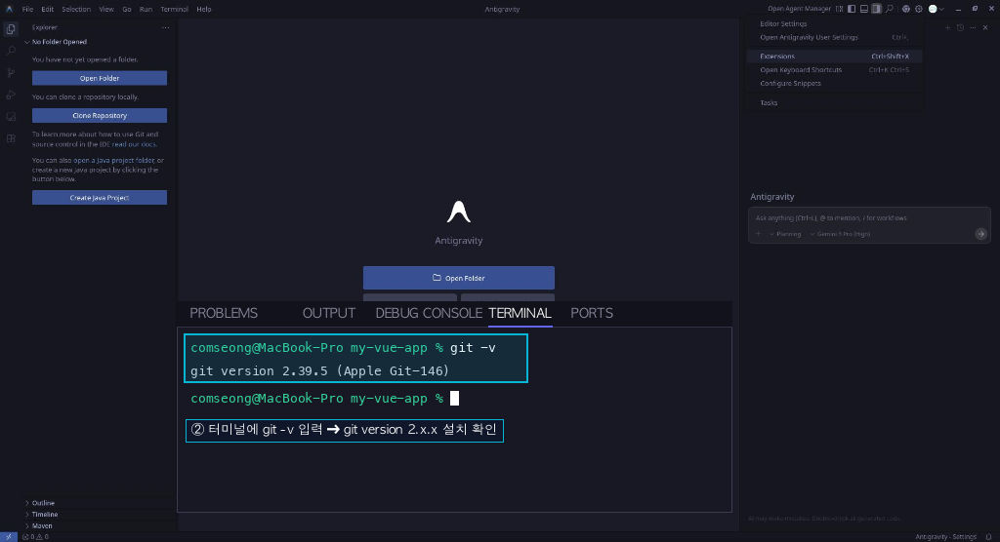

# 제2장: Vue.js로 앱 부활시키기 — 바닐라 JS에서 모던 프레임워크로

> 🎉 이 장의 작은 성공: 1권에서 만든 사마르칸트 투어 앱이 Vue 컴포넌트로 다시 살아난다!

## 0. 시작하기 전에: 왜 갑자기 내 컴퓨터에 Git을 설치하나요?

본격적으로 앱을 변환하기 전에, 코드를 안전하게 보관할 깃(Git) 저장소를 준비해야 합니다. 1권에서는 여러분이 코딩에 흥미를 잃지 않도록 복잡한 개념은 최대한 숨겼지만, 2권(심화편)에 오신 여러분은 이제 초보 딱지를 조금 뗐습니다! 따라서 프로 개발자라면 숨쉬듯 사용하는 '버전 관리'에 대해 조금 더 짚고 넘어가겠습니다.


**💡 1권에서는 Git을 설치하라는 말이 없었는데요?**

맞습니다. 1권에서 사용한 'Google AI Studio'는 인터넷 브라우저 안에서 동작하는 **온라인 클라우드 IDE**였습니다. 여러분의 코드가 이미 구글의 온라인 서버(클라우드) 위에 존재했기 때문에, 그 서버 안에 내장된 Git 시스템이 알아서 GitHub과 소통해주었습니다.

하지만 2권부터는 이야기가 다릅니다. 우리는 더 자유롭고 강력한 개발을 위해 **내 컴퓨터(로컬) 환경**에 직접 'Antigravity IDE'를 설치하고 내 하드디스크에 코드를 작성하기 시작했습니다.
원래 **'코드가 물리적으로 존재하는 곳'**에 Git이 함께 있어야만 코드의 변화를 추적하고, 이를 GitHub(온라인 백업 및 공유소)으로 밀어 올릴 수 있습니다. 따라서 이제는 구글 서버가 아닌, 내 진짜 컴퓨터에 Git이라는 프로그램을 직접 설치해야만 로컬 코드들을 깃허브와 연동할 수 있게 된 것입니다.


### 1단계: 내 컴퓨터에 Git 설치 확인 및 다운로드

먼저 내 컴퓨터에 '마법의 타임머신(Git)'이 설치되어 있는지 확인해 봅시다.

1. **설치 확인**: Antigravity IDE의 터미널(메뉴 바에서 `View` > `Terminal` 선택 또는 단축키 `Ctrl` + `` ` ``)을 열고 `git -v`라고 입력해 보세요. `git version 2.x.x` 처럼 설치되어 있는 Git의 버전 숫자가 나오면 이미 설치된 것입니다. 만약 "command not found" 등의 에러가 나면 신규 설치가 필요합니다.

<figure><figcaption><p>그림 2-1. Antigravity IDE 터미널 열기 및 git -v 버전 확인 화면</p></figcaption></figure>

2. **다운로드 및 설치**:
   - **Windows**: [Git 공식 홈페이지(git-scm.com)](https://git-scm.com/download/win)에 접속하여 64-bit 버전을 다운로드하고, 기본 설정(계속 'Next' 클릭)으로 설치를 완료합니다.
     (Windows의 경우, 설치 중 **"Adjusting your PATH environment"** 단계에서 **"Git from the command line and also from 3rd party software"** 옵션을 반드시 선택해야 외부 프로그램(Antigravity)이 Git을 인식할 수 있습니다.)
   - **Mac**: 터미널에 `git`이라고 입력하면 자동으로 설치 안내 팝업이 뜹니다. 안내에 따라 설치를 진행합니다.
3. 설치를 마친 후 IDE 터미널 창을 껐다가 다시 열고 `git -v`를 입력해 정상적으로 설치되었는지 확인합니다.

### 2단계: IDE와 GitHub 연동하기

작업한 코드를 내 컴퓨터뿐만 아니라 온라인(GitHub)에 안전하게 백업하려면 IDE와 GitHub 계정을 연결해야 합니다.

1. **GitHub 가입**: 아직 계정이 없다면 [github.com](https://github.com/)에서 회원가입을 완료해 주세요.
2. **IDE에 계정 연결**: Antigravity IDE 좌측 메뉴에서 **Source Control (나뭇가지 모양 아이콘)** 또는 **Accounts (사람 모양 아이콘)**를 클릭하고 **'Sign in to GitHub' (GitHub에 로그인)** 버튼을 선택합니다.
3. 웹 브라우저가 열리며 권한 승인(Authorize) 창이 나타납니다. 승인을 완료하면, 이제 IDE가 여러분의 GitHub 저장소를 만들고 코드를 올릴 수 있는 권한을 갖게 됩니다.

### 3단계: AI에게 저장소 생성 및 첫 커밋 맡기기

1권에서 사용했던 저장소에 이어서 작업할 수도 있지만, 코드가 완전히 바뀌는 2권(심화편)을 위해서는 **새로운 저장소(예: `vibe-tour-vue`)를 만들어 분리하는 것을 강력히 권장**합니다.

터미널에 복잡한 명령어를 직접 칠 필요 없이, AI에게 모든 것을 맡겨보세요. 프롬프트 창에 다음과 같이 입력합니다.

> 💬 "현재 생성된 Vue 프로젝트 폴더를 깃(Git) 저장소로 초기화해줘. 그리고 내 깃허브 계정에 `vibe-tour-vue`라는 이름으로 새로운 private 저장소를 만들어서 연동한 뒤, 초기 상태를 커밋하고 푸시해줘."

### 💡 작업 단위 커밋 습관화 (AI에게 위임하기)

2권에서도 기능 단위로 작업이 끝날 때마다 커밋(저장)하는 것은 필수입니다. 앞으로 매 챕터마다 주요 기능이 완성될 때, 직접 코드를 관리하려 하지 말고 AI에게 **"지금까지 작업한 내용(예: Vue 컴포넌트 변환 완료)을 요약해서 깃허브에 커밋하고 푸시해줘"** 라고 지시하는 습관을 들이세요.

---

## 1. 프롬프팅: 기존 앱을 Vue.js로 변환하기

우리는 지금 텅 빈 새로운 폴더(`vibe-tour-vue`)에 있습니다. 이제 1권에서 완성했던 바닐라 JS 코드를 AI에게 제공하고, 단 한 번의 명령으로 모던 프레임워크 앱으로 탈바꿈시킬 것입니다.

### 💡 어떻게 이전 코드(프론트엔드 + 백엔드)를 통째로 주입하나요?
앱을 변환할 때는 단순히 `index.html` 하나만 필요한 것이 아닙니다. 1권에서 만들었던 백엔드 API(`functions/api` 폴더) 등 전체 코드의 맥락이 필요합니다. Private(비공개) 저장소 권한 문제 등을 피하고 초보자가 가장 확실하게 할 수 있는 방법을 추천합니다.

**✅ 1권의 원본 폴더를 통째로 채팅창에 던져주기 (추천)**
1. 1권(온라인 IDE 또는 GitHub)에서 완성했던 **전체 소스 코드**를 내 컴퓨터로 다운로드(ZIP 등) 받거나 복사해 둡니다.
2. 해당 원본 작업 폴더 자체를 Antigravity IDE의 우측 AI 채팅창으로 **드래그 앤 드롭(끌어다 놓기)**하여 통째로 첨부합니다.

*(참고: 앞서 IDE에 GitHub 연동을 마쳤다면, 프롬프트 창에서 `@` 기호를 누르고 1권의 GitHub 저장소 URL을 직접 입력해 연결할 수도 있습니다. 하지만 폴더를 직접 첨부하는 것이 직관적이고 에러가 적습니다.)*

전체 코드 맥락이 AI에게 제공되었다면, 아래와 같이 프롬프트를 입력합니다.

> 💬 "제공한 GitHub 저장소(또는 폴더)가 기존 사마르칸트 투어 앱의 전체 원본 코드야. 이걸 기반으로 현재 빈 폴더에 새로운 Vue.js 프로젝트를 세팅하고 프론트엔드 코드를 변환해줘. 기존의 `functions/api` 백엔드 코드는 폴더 구조 그대로 유지해서 가져와주고, 1권에서 쓰던 Tailwind CSS 스타일이 그대로 적용되도록 세팅해. 프론트엔드 UI는 헤더, 메인 콘텐츠, 푸터를 각각 별도의 Vue 컴포넌트로 분리해서 App.vue에서 조립해줘."


**💡 Tailwind CSS는 어떻게 넘어가나요?** 1권의 `index.html`에 들어있던 `class="flex items-center ..."` 같은 Tailwind 클래스들은 Vue 컴포넌트의 `<template>`으로 그대로 복사됩니다. 위 프롬프트처럼 \*\*"Tailwind CSS 스타일 세팅"\*\*을 명시해주면, AI가 Vite 환경에 맞게 Tailwind 패키지를 설치하거나 `main.ts`에 CSS를 자동 연동해주므로 스타일이 깨지지 않고 깔끔하게 유지됩니다.


AI가 작업을 마치면 다음과 같은 파일들이 생성됩니다:

```
src/
├── App.vue
└── components/
    ├── AppHeader.vue   ← 헤더
    ├── TourList.vue    ← 투어 목록
    ├── GuideCard.vue   ← 가이드 카드
    └── AppFooter.vue   ← 푸터
```

이 변환 과정에서 AI에게 하나 더 부탁할 수 있습니다:

> 💬 "변환하면서 원래 기능(스크롤 애니메이션, 필터링 등)이 하나도 빠지지 않게 해줘. 변환이 끝나면 빠진 기능이 있는지 직접 확인하고 체크리스트를 보여줘."

## 2. 귀납적 코드 이해: AI가 뱉은 `.vue` 파일 해부하기

생성된 Vue 컴포넌트 파일을 열어보고 뼈대를 분석합니다. 처음 보면 낯설지만, 사실 1권에서 배운 것들의 재배열입니다.

```vue
<template>
  <!-- ← 여기가 HTML이구나! (1권에서 작성한 Tailwind 클래스가 그대로!) -->
  <div class="rounded-xl bg-white shadow-md p-4">
    <h2 class="text-xl font-bold">{{ guide.name }}</h2>
  </div>
</template>

<script setup lang="ts">
// ← 여기가 JavaScript 로직이구나!
const props = defineProps<{ guide: TourGuide }>();
</script>

<style scoped>
/* Tailwind CSS를 사용하면 <style> 영역이 거의 텅 비게 됩니다! */
/* 만약 Tailwind로 표현하기 힘든 특별한 CSS가 있다면 여기에 적습니다. (scoped = 이 컴포넌트에만 적용) */
</style>
```

`.vue` 파일의 구조는 **딱 세 구역**으로 나뉩니다. 1권에서 배운 것들과 대응시켜 보면 금방 이해됩니다.

| `.vue` 파일의 구역 | 1권에서 배운 것    | 역할                            |
| ------------------ | ------------------ | ------------------------------- |
| `<template>`       | `<body>` 안의 HTML | 화면에 보이는 구조              |
| `<script setup>`   | `<script>` 안의 JS | 데이터와 동작 처리              |
| `<style scoped>`   | 별도 CSS 파일      | 이 컴포넌트에만 적용되는 스타일 |

**각 부분을 더 자세히 살펴봅시다.**

### `{{ }}` — "이 데이터를 여기에 표시해줘"

`{{ guide.name }}`에서 이중 중괄호 `{{ }}`는 \*\*"이 변수의 값을 HTML에 끼워 넣어줘"\*\*라는 Vue만의 표현 방식입니다.

1권에서는 이렇게 했습니다:

```javascript
// 바닐라 JS — 직접 DOM을 찾아 값을 집어넣음
document.getElementById("guide-name").innerText = guide.name;
```

Vue에서는 이렇게 합니다:

```html
<!-- Vue — 그냥 변수 이름만 쓰면 끝 -->
<h2>{{ guide.name }}</h2>
```

`guide.name`이 바뀌면 `<h2>` 태그의 내용이 **자동으로** 바뀝니다. `document.getElementById`를 다시 호출할 필요가 없습니다.

### `<script setup>` — 왜 `setup`을 붙이는가?

`setup`은 Vue 3에서 도입된 최신 문법입니다. 이것이 없으면 더 길고 복잡한 방식으로 작성해야 합니다.

```vue
<!-- setup이 없는 옛날 방식 (Vue 2 스타일) -->
<script>
export default {
  props: ["guide"],
  // ... 훨씬 더 많은 코드
};
</script>

<!-- setup을 붙인 최신 방식 (Vue 3, Composition API) -->
<script setup lang="ts">
const props = defineProps<{ guide: TourGuide }>();
</script>
```

`setup`이 붙으면 훨씬 짧고 직관적입니다. AI가 생성하는 코드도 이 방식을 사용하므로, **"setup이 붙어있으면 최신 방식이구나"** 정도만 기억해두면 됩니다.

### `<style scoped>` — CSS 전쟁의 종결

1권에서 CSS를 전역으로 관리하다 보면, 어딘가에서 `.card { color: red; }`를 선언했는데 전혀 다른 곳의 카드까지 빨개지는 일이 생겼습니다. `scoped`는 이 문제를 근본적으로 해결합니다.

```vue
<!-- GuideCard.vue -->
<style scoped>
/* 이 CSS는 오직 GuideCard.vue 안에서만 작동합니다 */
.title {
  font-size: 1.5rem;
}
</style>
```

Tailwind CSS를 쓰면 `<style scoped>` 안을 쓸 일이 거의 없습니다. Tailwind의 유틸리티 클래스들이 이미 이 역할을 대신하기 때문입니다.

- **`document.getElementById`가 사라진 이유**: 바닐라 JS에서는 HTML을 직접 찾아서 값을 집어넣었지만, Vue에서는 데이터가 바뀌면 화면이 **알아서** 업데이트됩니다. 이것이 핵심 차이입니다.

## 3. 귀납적 코드 이해: Props — 컴포넌트 간 데이터 전달

AI가 생성한 코드를 보면 `defineProps`라는 낯선 함수가 등장합니다.

```vue
<!-- 부모: TourList.vue -->
<GuideCard :guide="selectedGuide" />

<!-- 자식: GuideCard.vue -->
<script setup lang="ts">
const props = defineProps<{ guide: TourGuide }>();
</script>
```

### Props를 레고로 이해하기

컴포넌트를 레고 블록이라고 생각해보세요. 레고 블록에는 **홈**(연결 부위)이 있어서, 특정 모양의 블록만 끼울 수 있습니다. Props가 바로 그 홈입니다.

```
[TourList (부모)]
    |
    | selectedGuide 데이터를 아래로 내려보냄
    ↓
[GuideCard (자식)]  ← "guide 라는 이름의 홈이 있습니다"
```

- **`defineProps`**: "나(자식 컴포넌트)는 이런 데이터를 받을 수 있어"라고 선언하는 것입니다.
- **`:guide="selectedGuide"`**: 앞의 \*\*`:`(콜론)\*\*이 결정적으로 중요합니다. 콜론이 **있으면** "이건 변수야, 변수의 값을 전달해"라는 뜻이고, 콜론이 **없으면** `"selectedGuide"`라는 텍스트 문자열 자체가 전달됩니다.

```html
<!-- 콜론 없음: 문자열 "selectedGuide" 가 전달됨 -->
<GuideCard guide="selectedGuide" />

<!-- 콜론 있음: selectedGuide 변수의 값(객체)이 전달됨 -->
<GuideCard :guide="selectedGuide" />
```

이 `:` 하나의 차이가 "텍스트 전달"과 "데이터 전달"을 나눕니다. 처음에 가장 많이 실수하는 부분이므로 꼭 기억해두세요.

## 4. 프롬프팅 + 이해: 상태 변화(Reactivity)를 몸으로 느끼기

`"버튼을 누르면 투어 예약 카운트가 올라가는 기능을 추가해줘"`라고 지시합니다.

결과 코드를 보며 발견합니다:

```vue
<script setup lang="ts">
import { ref } from "vue";
const count = ref(0);
</script>

<template>
  <button @click="count++">예약 ({{ count }})</button>
</template>
```

### `ref()` — Vue의 "살아있는 변수"

`ref(0)`는 그냥 숫자 `0`을 저장하는 것이 아닙니다. Vue가 **감시하고 있는** 특별한 변수입니다.

```javascript
// 1권 — 일반 변수 (바뀌어도 화면은 모름)
let count = 0;
count = count + 1; // 화면은 여전히 0을 표시

// Vue — ref 변수 (바뀌면 즉시 화면에 반영됨)
const count = ref(0);
count.value = count.value + 1; // 화면이 자동으로 1로 업데이트됨
```

`<template>` 안에서는 `.value`를 생략하고 그냥 `{{ count }}`라고 쓸 수 있습니다. Vue가 알아서 `.value`를 붙여 읽어줍니다.

### `@click` — 이벤트 처리의 짧은 표현

| 1권 바닐라 JS                                 | Vue                 |
| --------------------------------------------- | ------------------- |
| `element.addEventListener('click', handler)`  | `@click="handler"`  |
| `element.addEventListener('input', handler)`  | `@input="handler"`  |
| `element.addEventListener('submit', handler)` | `@submit="handler"` |

`@`는 "이벤트 발생 시"를 의미합니다. `@click="count++"`는 "클릭 이벤트 발생 시 count를 1 증가시켜"라고 읽으면 됩니다.


**💡 핵심 패러다임 전환: 데이터를 바꾸면 화면이 따라온다** 1권 방식: HTML을 직접 찾아 → 값을 집어넣음 (데이터 → DOM 조작 → 화면) Vue 방식: 데이터(ref)를 바꾸면 → 화면이 자동 반영됨 (데이터 → 화면)

이 차이가 Vue를 쓰는 가장 큰 이유입니다.


## 5. 프롬프팅: 컴포넌트 조립의 재미 — 달력 UI 추가

현재의 앱에는 날짜 선택 기능이 없습니다. AI에게 컴포넌트를 추가하도록 지시합니다.

> 💬 "달력에서 날짜를 고르면 해당 날짜에 가능한 가이드 목록만 보여주는 UI를 추가해줘. Vue 플러그인 중 초보자가 쓰기 좋은 달력 컴포넌트를 추천해서 설치하고 적용해."

AI가 `v-calendar` 또는 `vue-datepicker` 같은 라이브러리를 고르고, `package.json`에 추가한 뒤, 컴포넌트에 통합하는 과정을 보게 됩니다. 이 과정에서 확인할 것:

- `npm install v-calendar` 명령이 `package.json`의 `dependencies`에 새 줄을 추가하는 것
- 설치된 라이브러리가 `main.ts`에서 `app.use(VCalendar)` 형태로 등록되는 것
- **레고 블록처럼 기능을 조립하는** 프레임워크의 힘을 체감합니다.

## 6. 귀납적 이해: 바닐라 JS vs Vue.js — 무엇이 달라졌나?

| 항목                   | 바닐라 JS (1권)                    | Vue.js (2권)                |
| ---------------------- | ---------------------------------- | --------------------------- |
| HTML 수정              | `innerHTML` 직접 변경              | `ref` 값만 바꾸면 자동 반영 |
| 이벤트 처리            | `addEventListener('click', ...)`   | `@click`                    |
| 데이터를 화면에 표시   | `element.innerText = value`        | `{{ value }}`               |
| 데이터를 속성에 바인딩 | `element.setAttribute('src', url)` | `:src="url"`                |
| CSS 범위               | 전역 (충돌 위험)                   | `scoped` (컴포넌트 격리)    |
| 코드 분리              | 파일 하나에 혼재                   | 컴포넌트 단위 분리          |
| 재사용                 | 복사-붙여넣기                      | 컴포넌트 재사용             |

이 표는 AI에게 설명을 요청해서 만들어달라고 해도 됩니다. "바닐라 JS와 Vue.js의 차이를 마크다운 표로 비교해줘"라고 하면 이보다 더 자세한 비교표를 즉시 만들어줍니다.
