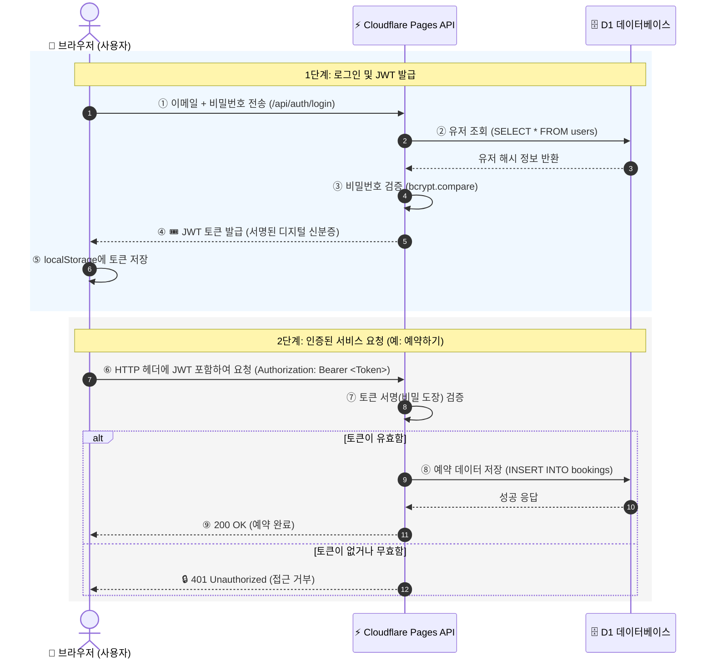

# 제4장: 인증 시스템 구현 — Cloudflare D1과 JWT 기반 로그인

> 🎉 이 장의 작은 성공: 회원가입 폼에 이메일과 비밀번호를 넣으면 진짜 로그인이 되고, 로그인한 사용자만 예약 페이지에 접근할 수 있다!

## 0. 핵심 개념 먼저: JWT가 뭐길래?

코드를 보기 전에 JWT가 왜 필요한지, 어떻게 작동하는지를 먼저 이해합니다.

### 로그인이란 결국 무엇인가?

웹 서비스에 로그인을 한다는 것은, **"나 이 사람이야"라는 사실을 서버에 증명하는 것**입니다. 그런데 웹은 기본적으로 **기억이 없습니다.** HTTP 요청은 매번 독립적이어서, 방금 전에 로그인 요청을 보낸 사람과 1초 뒤에 예약 요청을 보낸 사람이 같은 사람인지 서버는 알 수 없습니다.

이 문제를 해결하는 전통적인 방식이 **세션(Session)**입니다:
- 로그인 성공 → 서버가 "로그인 기록부"에 적어두고 → 브라우저에 번호표(세션 ID) 발급
- 이후 요청 때마다 브라우저가 번호표를 제시 → 서버가 기록부에서 확인

그런데 이 방식에는 문제가 있습니다. **서버가 기록부(메모리)를 항상 들고 있어야 합니다.** Cloudflare Functions처럼 요청이 올 때만 잠깐 켜졌다 꺼지는 서버리스 환경에서는 이 기록부를 유지할 수가 없습니다.

이 문제를 해결한 것이 바로 **JWT(JSON Web Token)**입니다.

### JWT — 도장 찍힌 신분증

JWT를 한 마디로 표현하면 **"서버가 직접 도장을 찍어준 디지털 신분증"**입니다.


**💡 여권에 비유하면**

- **여권 발급**: 로그인 성공 시 서버가 "이 사람은 userId=1, email=test@..." 정보를 담은 신분증에 **비밀 도장(서명)**을 찍어서 발급합니다.
- **여권 소지**: 브라우저가 이 신분증(토큰)을 보관합니다.
- **여권 제시**: 이후 모든 요청에 신분증을 함께 보냅니다.
- **여권 확인**: 서버는 도장만 확인합니다. 기록부가 없어도 됩니다. 도장이 진짜면 통과, 위조면 거절.

서버는 "누가 로그인 중인지"를 기억하지 않아도 됩니다. 신분증을 보여주면 그걸로 충분합니다.




### JWT 토큰의 생김새

실제 JWT 토큰은 이렇게 생겼습니다:

```
eyJhbGciOiJIUzI1NiJ9.eyJ1c2VySWQiOjEsImVtYWlsIjoidGVzdEBleGFtcGxlLmNvbSJ9.xyzABC...
```

점(`.`)으로 구분된 **세 파트**로 이루어져 있습니다:

| 파트 | 색상 | 내용 | 특징 |
|---|---|---|---|
| **Header** | 🔵 파란색 | 암호화 알고리즘 정보 (`HS256`) | Base64 인코딩 |
| **Payload** | 🟢 초록색 | 실제 데이터 (`userId`, `email`) | Base64 인코딩 (암호화 ❌) |
| **Signature** | 🟠 주황색 | 서버 비밀키로 서명한 값 | 위조 탐지에 사용 |


**⚠️ Payload는 암호화되지 않습니다!**
JWT의 Payload 부분은 누구나 Base64 디코딩으로 읽을 수 있습니다. 비밀번호, 주민등록번호 등 민감한 정보는 절대 Payload에 넣으면 안 됩니다. `userId`나 `email` 정도의 식별 정보만 담는 것이 안전합니다.


[jwt.io](https://jwt.io) 사이트에 위 토큰을 붙여넣으면 내용이 바로 디코딩됩니다. 직접 해보면 JWT의 구조가 눈에 잡힙니다.

### 비밀번호 해싱이란?

JWT와 함께 알아야 할 개념이 **비밀번호 해싱**입니다.

DB에 비밀번호를 그대로(`1234qwer`) 저장하면, DB가 해킹당했을 때 모든 사용자의 비밀번호가 그대로 유출됩니다. 이를 막기 위해 **해시(Hash) 함수**로 비밀번호를 변환해서 저장합니다.

```
원본 비밀번호:  "1234qwer"
            ↓ bcrypt 해시 함수 적용 (단방향 — 역산 불가)
저장되는 값:   "$2b$10$..." (알아볼 수 없는 문자열)
```

- **단방향**: 해시 값으로 원본 비밀번호를 역산할 수 없습니다.
- **검증 방식**: 로그인 시 입력한 비밀번호를 같은 방식으로 해싱해서 DB의 해시값과 비교합니다.

---

## 1. 사전 준비: Wrangler CLI 설치

D1 데이터베이스에 SQL(테이블 생성 등)을 직접 실행하려면 **Wrangler**가 필요합니다. Wrangler는 Cloudflare가 제공하는 공식 CLI(명령줄 도구)로, 로컬 IDE에서 Cloudflare 서비스를 제어하는 역할을 합니다.

1권에서는 Cloudflare 대시보드 웹 사이트에 직접 로그인해서 D1 테이블을 만들었습니다. 2권부터는 Wrangler를 설치해두면 Antigravity IDE의 터미널에서 바로 실행할 수 있습니다.

> 💬 "이 프로젝트에 Wrangler CLI를 개발 의존성으로 설치해줘. 그리고 로컬에서 Cloudflare 계정에 로그인하는 방법도 알려줘."

AI가 다음 명령을 실행해 줍니다:
```bash
npm install -D wrangler
npx wrangler login   # 브라우저가 열리고 Cloudflare 계정으로 인증
```


**💡 `npm install -D wrangler`의 의미**
- `npm install` — 패키지 설치
- `-D` — "개발 전용(devDependency)"으로 설치. 실제 배포 번들에는 포함되지 않고, 개발 작업에만 사용하는 도구임을 의미합니다.
- `wrangler` — Cloudflare CLI 도구 이름

`npx wrangler login` 이후 브라우저 창이 열리면 Cloudflare 계정으로 로그인합니다. 1권에서 만든 계정을 그대로 사용하면 됩니다.


## 2. 프롬프팅: D1을 재활용한 커스텀 인증 적용하기
새로운 외부 서비스(Supabase 등)를 배우는 대신, 1권에서 이미 익숙해진 Cloudflare D1(SQLite)을 확장합니다. D1에 유저 테이블 하나를 추가하는 것으로 인증 시스템의 DB 준비가 끝납니다.

> 💬 "기존 Cloudflare D1 데이터베이스에 유저(Users) 테이블을 추가하는 SQL 마이그레이션 파일을 만들어줘. 비밀번호는 해싱해서 저장하고, 로그인 성공 시 JWT 토큰을 발급하는 API(Pages Functions)를 만들어줘. 프론트엔드에는 회원가입과 로그인 폼 컴포넌트도 만들어."

AI가 생성하는 파일들:
- `migrations/0002_add_users.sql` — D1에 실행할 SQL
- `functions/api/auth/register.ts` — 회원가입 API
- `functions/api/auth/login.ts` — 로그인 API
- `src/components/RegisterForm.vue`
- `src/components/LoginForm.vue`

생성된 SQL 마이그레이션 파일을 열어 확인합니다:
```sql
CREATE TABLE IF NOT EXISTS users (
  id INTEGER PRIMARY KEY AUTOINCREMENT,
  email TEXT UNIQUE NOT NULL,
  password_hash TEXT NOT NULL,   -- 비밀번호는 절대 평문으로 저장하지 않는다
  created_at DATETIME DEFAULT CURRENT_TIMESTAMP
);
```

파일이 만들어졌다고 바로 D1에 적용되지는 않습니다. 이 SQL을 **실제 Cloudflare D1에 실행**해야 합니다. AI에게 이어서 요청합니다:

> 💬 "방금 만든 마이그레이션 파일을 Wrangler로 D1에 실제 실행해줘."

AI가 Antigravity IDE 터미널에서 다음 명령을 실행합니다:
```bash
npx wrangler d1 execute <DB이름> --file=migrations/0002_add_users.sql
```

`<DB이름>`은 1권에서 만든 D1 데이터베이스 이름입니다. 명령 실행 후 Cloudflare 대시보드에서 `users` 테이블이 생성된 것을 확인할 수 있습니다.


## 3. 귀납적 코드 이해: JWT(JSON Web Token)의 흐름 파악하기
생성된 로그인 함수 코드를 분석합니다. 위의 개념 설명과 대조하며 읽으면 코드의 의도가 바로 보입니다.

```typescript
// functions/api/auth/login.ts (AI 생성)
export const onRequestPost: PagesFunction = async ({ request, env }) => {
  const { email, password } = await request.json()

  // 1. DB에서 유저 찾기
  const user = await env.DB.prepare('SELECT * FROM users WHERE email = ?')
    .bind(email).first()

  // 2. 비밀번호 검증 (평문 vs 해시 비교)
  const isValid = await bcrypt.compare(password, user.password_hash)

  // 3. JWT 토큰 발급
  const token = await jwt.sign({ userId: user.id, email }, env.JWT_SECRET)

  return Response.json({ token })
}
```

코드를 순서대로 읽으며 앞의 개념과 연결합니다:
- **1단계 (DB에서 유저 찾기)**: 이메일로 DB를 조회해 해당 유저의 `password_hash`를 가져옵니다.
- **2단계 (비밀번호 검증)**: `bcrypt.compare`가 입력한 평문 비밀번호와 DB의 해시값을 비교합니다. DB에는 원본이 없으므로 DB가 털려도 비밀번호는 안전합니다.
- **3단계 (JWT 발급)**: 검증 통과 시 `{ userId, email }` 정보와 `env.JWT_SECRET`(비밀 도장)을 이용해 JWT를 생성합니다. 이 토큰이 브라우저로 전달됩니다.
- **Stateless 인증**: 서버는 누가 로그인 중인지 기억하지 않습니다(세션 없음). 매 요청마다 토큰을 보내면, 서버가 도장만 확인해 "아, 이 사람이구나"를 파악합니다. 서버리스 환경에 완벽하게 맞는 방식입니다.

> 💬 "JWT 토큰의 세 부분을 직접 코드로 디코딩해서 내용을 출력해주는 유틸 함수를 만들어줘."

## 4. 귀납적 코드 이해: 라우터 가드 — 로그인 안 하면 막기
AI가 작성한 `src/router/index.ts`의 `beforeEach` 가드 코드를 읽습니다.

```typescript
router.beforeEach((to, from, next) => {
  const token = localStorage.getItem('auth_token')
  const requiresAuth = to.meta.requiresAuth

  if (requiresAuth && !token) {
    // 토큰이 없는데 보호된 페이지에 접근하려 하면 → 로그인 페이지로 이동
    next({ name: 'Login' })
  } else {
    next()
  }
})
```

- **`beforeEach`**: 페이지를 이동하기 직전에 실행되는 함수입니다. 마치 건물 입구의 경비원 같습니다. 방문객(사용자)이 어느 방에 들어가려 해도 경비원이 먼저 신분증을 확인합니다.
- **`to.meta.requiresAuth`**: 라우터 설정에서 각 페이지에 `meta: { requiresAuth: true }`를 붙여두면, 이 가드에서 확인합니다. 모든 페이지가 아니라 "보호가 필요한 페이지"에만 표시를 붙이는 것입니다.
- **실제 동작**: 로그인하지 않은 사용자가 `/booking` 페이지 URL을 직접 입력하면, 이 가드가 가로채서 `/login` 페이지로 보냅니다. 토큰이 있으면 그냥 통과시킵니다.


**💡 `localStorage`란?**
브라우저가 제공하는 작은 저장공간입니다. 페이지를 새로고침해도 사라지지 않아서 JWT 토큰을 보관하는 용도로 많이 사용합니다. `localStorage.getItem('auth_token')`은 저장된 토큰을 꺼내오는 코드, `localStorage.setItem('auth_token', token)`은 토큰을 저장하는 코드입니다.


## 5. 프롬프팅 + 이해: 로그인 상태 전역 관리 (Pinia)
로그인 여부를 여러 컴포넌트에서 확인해야 합니다. 헤더에서는 "로그인/로그아웃" 버튼을, 예약 페이지에서는 유저 이름을 표시해야 합니다. 이 정보를 모든 컴포넌트가 공유하려면 전역 상태 관리가 필요합니다.

> 💬 "로그인 상태(토큰, 유저 이름)를 Pinia 스토어로 관리해줘. 로그인하면 스토어에 저장하고, 로그아웃하면 스토어와 localStorage를 모두 비워줘."

AI가 생성한 `src/stores/auth.ts`를 열어 `defineStore`의 구조를 파악합니다. Pinia는 Vue 공식 상태 관리 라이브러리로, 여러 컴포넌트가 같은 데이터를 바라보는 '단일 진실 공급원(Single Source of Truth)' 역할을 합니다.


**💡 Pinia란? — 앱 전체의 공용 냉장고**
2장에서 배운 `ref()`는 하나의 컴포넌트 안에서만 데이터를 관리합니다. 그런데 "로그인 상태"는 헤더, 예약 페이지, 마이페이지 등 여러 곳에서 동시에 알아야 합니다.

Pinia는 **앱 전체가 공유하는 냉장고**입니다. 어떤 컴포넌트에서든 같은 냉장고에서 데이터를 꺼내 쓸 수 있고, 한 곳에서 값을 바꾸면 모든 곳에 자동으로 반영됩니다.

