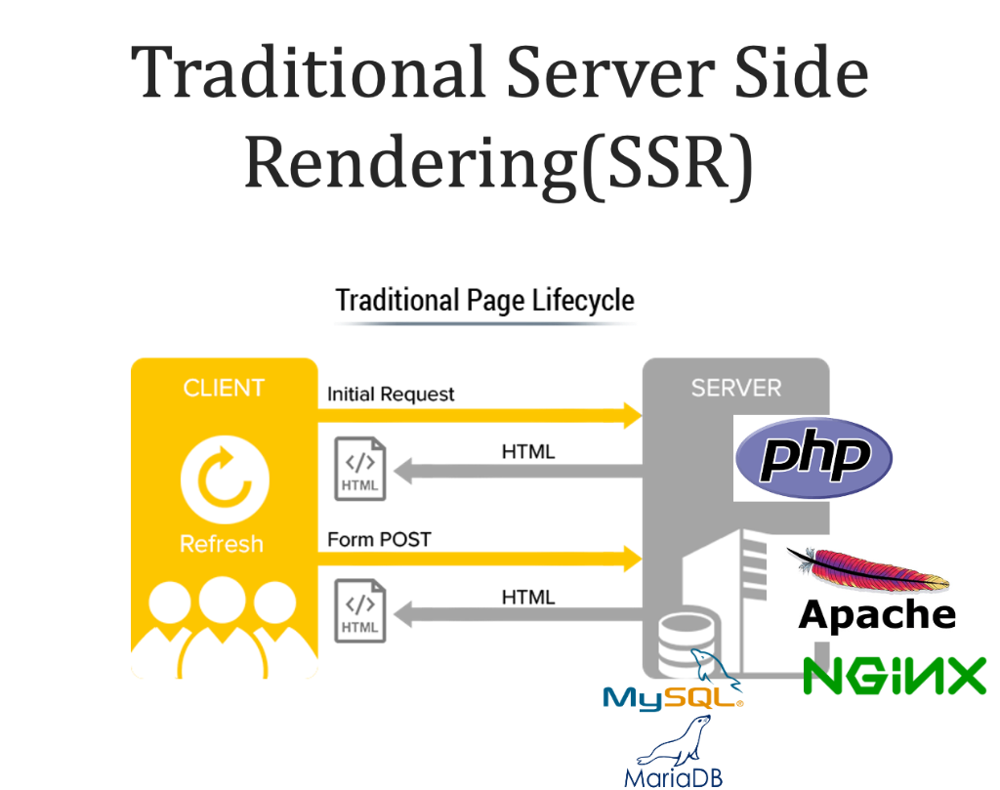
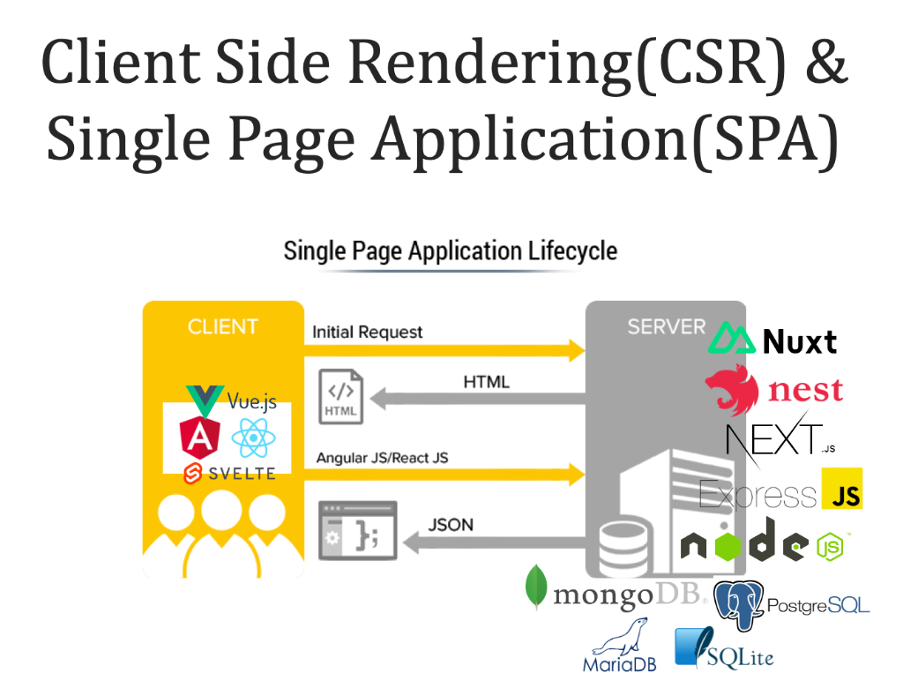

# 제4장: Vite-SSG — 빠르고 검색에 잘 걸리는 앱 만들기

> 🎉 이 장의 작은 성공: `npm run build`를 실행하면 `dist/` 폴더에 여러 개의 완성된 HTML 파일이 뚝딱 만들어진다!

3장에서 TypeScript로 코드에 안전망을 씌웠습니다. 이번 장에서는 앱의 *성능*과 *검색 노출*이라는 두 가지 현실적인 문제를 해결합니다.

이 장을 시작하기 전에 잠깐, 웹 페이지가 브라우저 화면에 표시되기까지 어떤 과정을 거치는지 큰 그림을 먼저 이해하면 나머지 내용이 훨씬 쉽게 들어옵니다.

## 0. 웹 렌더링 방식의 역사 — "어디서 HTML을 만드느냐"의 문제

웹 개발의 역사는 "누가, 언제 HTML을 만드는가"에 대한 고민의 역사라고 해도 과언이 아닙니다. 크게 세 가지 시대를 거쳐 왔습니다.

### 0-1. 전통적인 서버 사이드 렌더링(SSR) 시대



위 그림을 보세요. 클라이언트(브라우저)가 서버에 요청을 보내면, **서버** 쪽의 PHP(또는 JSP, Ruby on Rails 등)가 데이터베이스에서 데이터를 가져와 HTML을 완성한 뒤 클라이언트에게 보내줍니다.

**전통 SSR의 동작 흐름:**

```
①  브라우저 → "index.php 줘!" → 서버 (Apache/Nginx)
②  서버 → PHP 실행 → DB에서 데이터 조회
③  PHP → 데이터를 HTML에 끼워넣어 완성
④  서버 → 완성된 HTML → 브라우저
⑤  사용자가 링크 클릭 → 다시 ①부터 반복 (페이지 전체 새로고침)
```

- **장점**: 서버가 완성된 HTML을 보내주므로, 구글 봇이 내용을 바로 읽을 수 있습니다(SEO — 검색 엔진 최적화, 쉽게 말해 구글 검색 결과 상위에 잘 노출되는 것 — 에 유리). 첫 화면도 빠릅니다.
- **단점**: 버튼 하나 클릭해도 페이지 전체를 다시 불러와야 합니다. 이때 화면이 깜빡이는 현상(새로고침)이 발생하고, 서버에 매번 부하가 걸립니다.

> 💡 **실제 예**: 네이버 블로그의 초창기 버전, 옛날 쇼핑몰 사이트들이 이 방식으로 만들어졌습니다.

---

### 0-2. CSR(Client Side Rendering)과 SPA(Single Page Application) 시대



스마트폰이 대중화되고 웹 앱이 복잡해지면서 **"페이지 새로고침 없이 동작하는 앱"** 에 대한 수요가 폭발했습니다. 이를 해결한 것이 Vue.js, React, Angular 같은 JavaScript 프레임워크와 CSR 방식입니다.

**CSR + SPA의 동작 흐름:**

```
①  브라우저 → "index.html 줘!" → 서버
②  서버 → 텅 빈 index.html + main.js → 브라우저
③  브라우저 → main.js 다운로드 & 실행
④  JavaScript가 브라우저 안에서 HTML을 직접 생성(렌더링)
⑤  사용자가 링크 클릭 → JavaScript가 화면 일부만 교체 (새로고침 없음!)
⑥  필요한 데이터 → 서버에 JSON으로 요청 → 받아서 화면 갱신
```

위 그림에서 보듯이, 클라이언트 쪽에 Vue.js / Angular / React / Svelte 같은 프레임워크가, 서버 쪽에는 Node.js, Express, Nuxt, NestJS, Next.js 같은 JavaScript 기반 서버 기술들이 등장했습니다. 데이터베이스도 MongoDB, PostgreSQL, MariaDB, SQLite 등 다양해졌습니다.

- **장점**: 페이지 전환이 부드럽고 앱처럼 동작합니다. 서버와는 HTML이 아닌 JSON 데이터만 주고받아 훨씬 효율적입니다.
- **단점**: 처음 페이지를 열면 JavaScript 파일을 다운받고 실행하는 동안 **빈 화면**이 보입니다. 구글 봇도 이 빈 화면만 보게 됩니다. → 바로 지금 우리 앱의 문제입니다!

> 💡 **실제 예**: 현재 Gmail, Google Docs, 트위터(X) 등 대부분의 현대 웹 앱이 SPA 방식을 사용합니다.

---

이제 위 두 방식의 문제를 정확히 이해했으니, 본론으로 들어가겠습니다.

## 1. 지금 앱의 두 가지 문제

2장에서 만든 Vue 앱은 CSR/SPA 방식입니다. 이를 배포하면 어떤 일이 일어날까요?

### 문제 1: 첫 화면이 느리다 (흰 화면 문제)

브라우저가 서버에서 받은 HTML 파일을 열어보면 이렇습니다:

```html
<!-- samarkand-local-mate의 실제 index.html -->
<!DOCTYPE html>
<html lang="ko">
<head>
  <meta charset="utf-8"/>
  <meta content="width=device-width, initial-scale=1.0" name="viewport"/>
  <title>Samarkand Local Mate | Find Your Local Guide</title>
  <link href="https://fonts.googleapis.com/css2?family=Inter:wght@400;600&family=Playfair+Display:wght@600;700&display=swap" rel="stylesheet"/>
</head>
<body class="bg-background text-on-background font-body-md antialiased overflow-x-hidden">
  <div id="app"></div>
  <!-- ← 텅 비어 있음! 브라우저가 아래 스크립트를 다운받아 실행하기 전까지는 빈 화면입니다 -->
  <script type="module" src="/src/main.ts"></script>
</body>
</html>
```

`<div id="app">` 이 텅 비어 있습니다. 실제 배포 환경에서는 브라우저가 `main.js`(Vite가 `main.ts`를 번들링하여 생성한 자바스크립트 파일)를 내려받고, 해석하고, 실행해야 비로소 화면이 그려집니다.

이 과정을 시간대별로 표현하면:

```
0ms    : 브라우저가 index.html 받음 → 화면은 여전히 비어 있음 😐
300ms  : main.js 파일 다운로드 완료
800ms  : JavaScript 파싱 & Vue 앱 초기화 완료
1200ms : 화면에 콘텐츠 표시 🎉
```

사용자는 0ms~1200ms 동안 **하얀 빈 화면**을 봅니다. 모바일이나 느린 인터넷 환경에서는 이 시간이 3~5초까지 늘어날 수 있습니다. 사용자 연구에 따르면 3초 이상 기다리면 약 40%의 사용자가 페이지를 떠납니다.

### 문제 2: 구글이 빈 화면만 본다 (SEO 문제)

구글 검색 봇이 우리 사이트를 방문합니다. 봇은 HTML을 읽어서 페이지 내용을 파악하는데, `<div id="app"></div>` — 아무것도 없습니다. JavaScript를 실행해서 기다려주지 않거든요.

```
구글 봇이 본 것:
  <div id="app"></div>
  ↓
  "사마르칸트 투어나 가이드 정보가 하나도 없네?"
  ↓
  검색 결과 하위 노출 또는 색인 제외
```

결과적으로 구글은 이 페이지가 비어 있다고 판단하고 검색 결과에서 낮은 순위를 부여하거나 아예 색인하지 않습니다.

우리 앱에는 *"사마르칸트에서 나만의 로컬 가이드를 만나보세요"*, *"역사 · 미식 · 사진 맞춤 가이드"*, *"알리셰르 (Alisher) 역사 전문 가이드"* 같은 훌륭한 콘텐츠가 가득하지만, 구글 검색 봇은 이를 전혀 볼 수 없습니다. 사마르칸트 투어 앱인데 "사마르칸트 투어", "사마르칸트 로컬 가이드"로 검색해도 안 나온다면 여행자들이 우리 서비스를 찾아올 방법이 없겠죠.


**💡 SPA vs SSG — 택배로 비유하기**

**SPA(Single Page Application) 방식**: 빈 택배 상자를 먼저 보내고, 상자 안에 '조립 설명서(JavaScript)'를 넣어둡니다. 받는 사람(브라우저)이 설명서를 읽고 직접 내용물을 조립해야 합니다. → 조립 시간만큼 기다려야 함

**SSG(Static Site Generation) 방식**: 공장(빌드 서버)에서 내용물을 미리 다 조립한 완성품을 보냅니다. 받는 사람은 상자를 열자마자 바로 사용할 수 있습니다. → 기다릴 필요 없음


## 2. 해결책: Vite-SSG

**Vite-SSG**는 두 세계의 장점을 합칩니다.

- **개발 중**: 빠르고 유연한 Vue SPA처럼 편하게 작업
- **배포 시**: 각 페이지를 완성된 HTML 파일로 미리 구워서 배포

"SSG(Static Site Generation)"는 "정적 사이트 생성"으로, **빌드 시점에 JavaScript를 미리 실행해서 완성된 HTML을 파일로 저장해두는 기술**입니다. 사용자가 페이지를 요청하면 서버는 이미 만들어진 HTML 파일을 그냥 전달하기만 하면 됩니다.

### 세 가지 방식 한눈에 비교

| 방식      | HTML을 만드는 시점      | 만드는 장소   | 첫 로딩 속도 | SEO      | 서버 필요 여부         |
| --------- | ----------------------- | ------------- | ------------ | -------- | ---------------------- |
| 전통 SSR  | 사용자 요청마다         | 서버          | 빠름         | 강함     | 필요 (항상 실행)       |
| SPA (CSR) | 브라우저에서 JS 실행 후 | 브라우저      | 느림         | 취약     | 불필요 (정적 파일)     |
| **SSG**   | **빌드 시 한 번**       | **빌드 서버** | **빠름**     | **강함** | **불필요 (정적 파일)** |

SSG는 전통 SSR처럼 빠른 첫 로딩과 SEO를 제공하면서도, 서버 없이 정적 파일만으로 배포할 수 있어서 1권에서 배운 **Cloudflare Pages** 같은 서비스에 그대로 올릴 수 있습니다. 가장 좋은 부분만 쏙 뽑은 방식이라고 할 수 있습니다.


**⚠️ SSG의 한계: 실시간 데이터에는 주의**

SSG는 "빌드 시점에 미리 만들어두는" 방식이므로, 실시간으로 자주 바뀌는 데이터(예: 실시간 주식 가격, 채팅 메시지)에는 적합하지 않습니다.

현재 수준의 투어 앱의 경우, 가이드 정보나 투어 상품 설명은 자주 바뀌지 않으므로 현재 수준의 SSG를 적용하면 됩니다. 새로운 상품을 추가하면 다시 빌드해서 배포하면 됩니다.

**그러나, 나중에 가이드가 직접 자기 소개를 수시로 수정하는 기능이 필요해진다면?**
걱정하지 마세요 — 이럴 때는 **SSG + 실시간 API 하이브리드** 방식으로 자연스럽게 발전시킬 수 있습니다.

```
① SSG가 미리 구워둔 HTML이 즉시 화면에 표시됨 (빠른 로딩 + SEO 유지)
② 화면이 뜬 직후, Vue가 백엔드 API를 호출해 최신 가이드 정보를 가져옴
③ 화면의 내용을 최신 데이터로 조용히 교체
```

사용자는 기다림 없이 화면을 보고, 0.2~0.3초 뒤 최신 정보로 부드럽게 업데이트됩니다. SSG의 속도와 SEO 장점을 유지하면서 실시간 데이터도 함께 쓸 수 있는 실무에서 가장 흔히 쓰는 패턴입니다.


## 3. 프롬프팅: Vite-SSG 적용하기

> 💬 "이 웹앱의 초기 로딩이 느린데, `vite-ssg`를 도입해서 빌드할 때 정적 HTML을 미리 뽑아내게 설정해줘. 라우터 설정도 같이 수정해서 각 투어 상세 페이지가 별도의 HTML로 생성되게 해."

AI가 수행하는 작업 순서를 하나씩 살펴보겠습니다.

### 1단계: `vite-ssg` 패키지 설치

```bash
npm install -D vite-ssg
```

패키지 설치는 항상 첫 번째 단계입니다. `npm install -D`는 빌드 도구인 `vite-ssg`를 개발 의존성(`devDependencies`)으로 내려받고, `package.json`에 기록합니다.

### 2단계: `main.ts` 수정 — SSG용 export 추가

`samarkand-local-mate`의 기존 SPA 방식 `main.ts`가 어떻게 생겼는지 먼저 보고, 무엇이 달라지는지 비교해봅니다:

```typescript
// 기존 main.ts — SPA 방식 (samarkand-local-mate/src/main.ts)
import { createApp } from 'vue';
import App from './App.vue';
import './assets/main.css';

createApp(App).mount('#app');
//              ↑ 브라우저 DOM의 #app 요소에 앱을 즉시 마운트
//                브라우저 환경에서만 실행 가능!
```

SSG 방식으로 수정:

```typescript
// 수정된 main.ts — SSG 방식
import { ViteSSG } from 'vite-ssg';
import App from './App.vue';
import './assets/main.css';
import { routes } from './router'; // 라우트 정보 가져오기

// createApp 대신 ViteSSG를 export
export const createApp = ViteSSG(App, { routes });
```

**무엇이 달라졌나요?**

| 항목          | 기존 SPA                     | SSG 방식                 |
| ------------- | ---------------------------- | ------------------------ |
| 가져오는 함수 | `createApp` (vue에서)        | `ViteSSG` (vite-ssg에서) |
| 동작          | `.mount('#app')` — 즉시 실행 | `export` — 내보내기만 함 |
| 실행 주체     | 브라우저                     | 빌드 도구 (Vite-SSG)     |

변경의 핵심: `createApp(...).mount()` 대신 `ViteSSG(...)`를 `export`합니다. 빌드 시 Vite-SSG가 이 함수를 가져가서 각 라우트를 미리 방문하고 완성된 HTML을 생성합니다. 마치 "나중에 필요할 때 가져다 쓰세요"라고 완성 레시피를 내놓는 것과 같습니다.

### 3단계: `vite.config.ts` 확인

```typescript
// vite.config.ts
import vue from '@vitejs/plugin-vue';
import path from 'path';
import { defineConfig } from 'vite';

export default defineConfig({
  plugins: [vue()],
  resolve: {
    alias: {
      '@': path.resolve(__dirname, './src'),
    },
  },
  // vite-ssg는 별도 복잡한 플러그인 설정 없이 main.ts의 createApp export만으로 작동합니다
});
```

`vite.config.ts`는 Vite 빌드 도구의 설정 파일입니다. 다행히 Vite-SSG는 이 파일을 크게 건드리지 않아도 됩니다. `main.ts`의 `export const createApp` 패턴만 있으면 자동으로 SSG 모드로 빌드합니다.

### 4단계: `package.json` — 빌드 스크립트 확인

```json
{
  "name": "samarkand-local-mate",
  "scripts": {
    "dev": "vite --port=3000 --host=0.0.0.0",
    "build": "vite-ssg build",
    "preview": "vite preview"
  }
}
```

`"build"` 스크립트가 `vite build`에서 `vite-ssg build`로 변경됩니다. 이것이 핵심입니다. `npm run build`를 실행하면 일반 Vite 빌드가 아니라 Vite-SSG가 빌드를 담당합니다.

**각 스크립트의 역할:**

- `npm run dev`: 개발 서버 실행 (파일 변경 시 자동 새로고침, 포트 3000)
- `npm run build`: 배포용 정적 HTML 파일 생성 (`dist/` 폴더에 결과물)
- `npm run preview`: 빌드 결과물을 로컬에서 미리보기

## 4. 귀납적 이해: 빌드 결과물로 SSG 원리 발견하기

`npm run build`를 실행한 후 생성된 `dist/` 폴더를 IDE에서 열어봅니다.

```
dist/
├── index.html              ← 메인 랜딩 페이지 (HeroSection, 매칭 폼 등 완성된 HTML!)
├── guides/
│   ├── index.html          ← 가이드 목록 페이지
│   ├── alisher/
│   │   └── index.html      ← 알리셰르 가이드 상세 페이지
│   ├── dilshod/
│   │   └── index.html      ← 딜쇼드 가이드 상세 페이지
│   ├── nigora/
│   │   └── index.html      ← 니고라 가이드 상세 페이지
│   └── jamshid/
│       └── index.html      ← 잠시드 가이드 상세 페이지
└── assets/
    ├── main.js             ← 번들된 JavaScript (Hydration용)
    └── main.css            ← 사마르칸트 테마 Tailwind CSS
```

**"Vue SPA인데 왜 여러 개의 `.html` 파일이 나왔지?"**

SSG가 빌드 시점에 각 라우트를 *미리 방문*해서 HTML 스냅샷을 찍어두는 방식이기 때문입니다. 브라우저가 `/guides/alisher`에 접속하면, JavaScript가 실행되기도 전에 이미 완성된 HTML이 전달됩니다.

**빌드 과정을 단계별로 상상해보면:**

```
Vite-SSG 빌드 프로세스:
  ① routes 배열에서 '/' 발견 → 가상 브라우저로 접속 → HTML 스냅샷 → index.html 저장
  ② routes 배열에서 '/guides' 발견 → 가상 브라우저로 접속 → HTML 스냅샷 → guides/index.html 저장
  ③ routes 배열에서 '/guides/alisher' 발견 → 가상 브라우저로 접속 → HTML 스냅샷 → guides/alisher/index.html 저장
  ④ routes 배열에서 '/guides/dilshod' 발견 → 가상 브라우저로 접속 → HTML 스냅샷 → guides/dilshod/index.html 저장
  ... (모든 라우트 반복)
  ⑤ JavaScript와 CSS를 최적화해서 assets/ 폴더에 저장
  빌드 완료! 🎉
```

각 HTML 파일을 열어보면 텅 빈 `<div id="app">` 대신 실제 콘텐츠가 들어있는 것을 확인할 수 있습니다:

```html
<!-- dist/guides/alisher/index.html — SSG가 미리 렌더링한 실제 결과 -->
<div id="app">
  <nav class="bg-surface/80 shadow-sm sticky top-0 backdrop-blur-md z-50">
    <a class="font-bold text-[#C8953C]" href="/">Samarkand Local Mate</a>
  </nav>
  <main class="max-w-4xl mx-auto p-8">
    <div class="flex items-center space-x-4 mb-6">
      <div class="w-16 h-16 rounded-full bg-amber-100 flex items-center justify-center text-amber-600 font-bold text-2xl">
        알
      </div>
      <div>
        <h1 class="text-3xl font-bold text-slate-800">알리셰르 (Alisher)</h1>
        <p class="text-amber-600 font-medium">역사 및 고건축 전문 가이드 · ⭐ 4.9</p>
      </div>
    </div>
    <p class="text-slate-600 leading-relaxed">
      사마르칸트 국립대 역사학과 출신으로 레기스탄과 샤히진다의 숨겨진 역사를 깊이 있게 전달합니다.
    </p>
    <div class="mt-4 text-sm text-slate-500">
      구사 가능 언어: 한국어, 우즈베크어, 러시아어
    </div>
  </main>
</div>
```

구글 봇이 이 파일을 읽으면, 내용이 가득한 HTML을 완전히 파악할 수 있습니다. 더 이상 "빈 페이지" 문제가 없습니다!


**💡 Hydration — SSG와 SPA의 결합**

SSG가 만든 HTML 파일을 브라우저가 받으면, 사용자는 즉시 내용을 볼 수 있습니다. 그 후 JavaScript가 로드되면 Vue가 이미 그려진 HTML에 _다시 연결_(hydration)되어 버튼 클릭 등의 인터랙션이 활성화됩니다.

```
1. 브라우저가 HTML 받음      → 즉시 화면에 콘텐츠 표시 (빠름! 👀)
2. JS 파일 로드·실행         → Vue가 HTML에 연결(hydration)
3. Hydration 완료            → 버튼, 애니메이션 등 인터랙션 활성화 🖱️
```

**Hydration**이라는 단어가 "수분 공급"을 뜻하는 이유: 말라있는 정적 HTML에 JavaScript라는 "물"을 부어주면 생기를 띄게 된다는 비유입니다. 정적 HTML은 볼 수는 있지만 클릭해도 반응이 없는 상태, hydration 이후에는 완전히 상호작용 가능한 상태가 됩니다.

결과적으로 사용자는 로딩 화면 없이 바로 내용을 보고, 잠깐 뒤에 인터랙션이 가능해집니다.


## 5. 귀납적 이해: 라우터 설정 살펴보기

AI가 SSG용으로 수정한 라우터 파일을 열어봅니다.

```typescript
// src/router/index.ts
import { createRouter, createWebHistory } from "vue-router";
import type { RouteRecordRaw } from "vue-router";

// routes를 named export로 내보내야 vite-ssg가 사용 가능
export const routes: RouteRecordRaw[] = [
  {
    path: "/",
    component: () => import("@/App.vue"),
  },
  {
    path: "/guides",
    component: () => import("@/components/ResultSection.vue"),
  },
  {
    path: "/guides/:id",
    // ↑ :id는 동적 파라미터 (alisher, dilshod, nigora, jamshid)
    component: () => import("@/pages/GuideDetailPage.vue"),
  },
];

export default createRouter({
  history: createWebHistory(),
  routes,
});
```

**주목할 점 — `export const routes`:**

기존에는 `routes` 배열을 따로 내보내지 않고 `createRouter` 안에서만 사용했을 것입니다. SSG 방식에서는 `routes`를 `export const`로 _이름을 붙여 내보내는_ 이유가 있습니다: `main.ts`에서 `ViteSSG(App, { routes })`에 직접 전달해야 하기 때문입니다.

Vite-SSG가 이 배열을 보고 "어떤 페이지들이 있는지" 파악한 뒤 하나씩 방문해서 HTML을 생성합니다.

**`() => import(...)` 문법 이해하기:**

```typescript
component: () => import("@/pages/GuideDetailPage.vue");
```

이것을 **동적 임포트(Lazy Loading)** 라고 합니다. "이 컴포넌트는 실제로 필요할 때 불러오세요"라는 의미입니다. 덕분에 처음 접속할 때 모든 페이지 코드를 한꺼번에 내려받지 않고, 필요한 페이지 코드만 그때그때 불러옵니다. 앱 초기 로딩 속도를 더 빠르게 만드는 기법입니다.

## 6. 동적 라우트와 SSG — 가이드 상세 페이지

`/guides/:id`처럼 동적 라우트(파라미터가 있는 URL)는 SSG에서 약간 특별하게 다룹니다.

**문제 상황을 이해해봅시다:**

SSG는 빌드 시점에 "어떤 URL들이 있는지" 미리 알아야 합니다. `/`나 `/guides`는 고정된 URL이라 괜찮습니다. 하지만 `/guides/:id`는 `:id` 자리에 무엇이 올지 모릅니다. `alisher`? `dilshod`? `nigora`? 새로 추가한 가이드는요?

> 💬 "가이드 상세 페이지(`/guides/:id`)가 SSG로 미리 생성되려면 어떤 id들이 있는지 알아야 할 텐데, 이걸 어떻게 설정해?"

AI가 안내하는 방법 — `vite-ssg`의 `includedRoutes` 옵션:

```typescript
// main.ts
export const createApp = ViteSSG(
  App,
  { routes },
  ({ router, app, isClient }) => {
    // 클라이언트 사이드 초기화 로직 (플러그인 추가 등)
  },
  {
    // 빌드 시 생성할 동적 라우트 목록을 samarkand-local-mate 실제 가이드 ID로 지정
    includedRoutes(paths) {
      return paths.flatMap((path) => {
        if (path === "/guides/:id") {
          // samarkand-local-mate의 실제 가이드 ID 목록으로 URL 생성
          return [
            "/guides/alisher",
            "/guides/dilshod",
            "/guides/nigora",
            "/guides/jamshid"
          ];
        }
        return [path]; // 다른 라우트('/', '/guides')는 그대로 유지
      });
    },
  },
);
```

**`flatMap`이 하는 일:**

```
입력: ['/guides/:id', '/guides', '/']
처리: '/guides/:id' → ['/guides/alisher', '/guides/dilshod', '/guides/nigora', '/guides/jamshid']
      '/guides'     → ['/guides']
      '/'           → ['/']
출력: ['/guides/alisher', '/guides/dilshod', '/guides/nigora', '/guides/jamshid', '/guides', '/']
```

`flatMap`은 배열의 각 항목을 변환하는 동시에, 변환 결과가 배열이면 펼쳐서(flat) 합쳐줍니다. 결과적으로 "생성해야 할 URL의 목록"을 만들어냅니다.

실제 프로덕션에서는 하드코딩 대신 API를 호출해서 모든 가이드 ID를 가져온 뒤 이 목록을 동적으로 생성합니다:

```typescript
includedRoutes(paths) {
  return paths.flatMap(async (path) => {
    if (path === "/guides/:id") {
      // samarkand-local-mate의 실제 Cloudflare Pages API (/api/guides) 호출
      const res = await fetch("https://samarkand-local-mate.pages.dev/api/guides");
      const guides = await res.json();
      return guides.map((guide: any) => `/guides/${guide.id}`);
    }
    return [path];
  });
}
```

새 가이드를 추가하면 다시 `npm run build`를 실행하면 됩니다. 새 가이드의 HTML도 자동으로 생성됩니다.

## 7. Cloudflare Pages에 배포하기

1권에서 이미 Cloudflare Pages 배포를 배웠습니다. SSG 결과물도 똑같이 정적 파일이기 때문에 설정이 거의 동일합니다.

```
Cloudflare Pages 빌드 설정:
- 프레임워크 프리셋: None (직접 설정)
- 빌드 명령어: npm run build
- 빌드 출력 디렉터리: dist
```

**배포 흐름:**

```
개발자가 코드 푸시 → GitHub 저장소 업데이트
    ↓
Cloudflare Pages가 자동 감지
    ↓
npm run build 자동 실행 (Cloudflare 서버에서)
    ↓
dist/ 폴더의 HTML 파일들이 전 세계 CDN에 배포
    ↓
사용자가 어디서 접속하든 가장 가까운 서버에서 HTML 즉시 전달
```

### 동적 라우트를 위한 \_redirects 파일

한 가지 추가 설정이 필요합니다 — 동적 라우트를 위한 리다이렉트 파일:

```
# public/_redirects
/* /index.html 200
```

이 파일이 없으면 `/guides/alisher`를 직접 주소창에 입력했을 때 404 오류가 납니다. 왜 그럴까요?

Cloudflare Pages는 실제 파일만 서빙합니다. SSG가 미처 생성하지 못한 URL(예: 오타가 난 URL)을 요청하면 파일이 없으므로 404가 납니다. `_redirects` 파일은 "어떤 URL이든 일단 `/index.html`로 보내줘(200)"라는 폴백(fallback) 규칙을 설정합니다.

`public/` 폴더에 이 파일을 놓으면 빌드 시 자동으로 `dist/`로 복사됩니다:

```bash
# public/_redirects 파일 생성
echo "/* /index.html 200" > public/_redirects
```

> 💬 "SSG 앱을 Cloudflare Pages에 배포할 때 필요한 설정 파일이나 주의사항을 알려줘."

## 8. `npm run build` 전후 비교

SSG 적용 전후로 실제 차이를 확인하는 방법:

### Lighthouse 점수 확인 (Chrome 개발자 도구)

Chrome 브라우저에서 F12 → Lighthouse 탭 → "Analyze page load" 버튼을 클릭하면 아래와 같은 점수를 확인할 수 있습니다.

```
적용 전 (SPA):
  Performance:   65    ← "보통" 수준
  SEO:           72    ← 구글 노출 불리
  First Paint:   3.2초 ← 흰 화면 3초 이상

적용 후 (SSG):
  Performance:   94    ← "좋음" 수준
  SEO:           98    ← 구글 최적화
  First Paint:   0.8초 ← 거의 즉시 표시
```

**Performance 점수가 65 → 94로 오른 이유:**

- First Contentful Paint(FCP): 첫 콘텐츠가 화면에 나타나는 시간이 대폭 단축됨
- Time to Interactive(TTI): 사용자가 인터랙션할 수 있게 되는 시간 단축
- Cumulative Layout Shift(CLS): SSG HTML이 미리 레이아웃을 잡아줘서 화면 흔들림 최소화

**SEO 점수가 72 → 98로 오른 이유:**

- 구글 봇이 실제 콘텐츠를 HTML에서 바로 읽을 수 있음
- `<title>`, `<meta description>` 태그도 각 페이지별로 올바르게 설정 가능
- 페이지 로딩 속도 자체가 SEO 점수에 영향을 줌

> 💬 "현재 앱을 Lighthouse로 측정했더니 Performance가 65점이야. SSG 적용 후 개선할 수 있는 추가 최적화 방법도 알려줘."

### 실제로 차이를 느껴보는 법

빌드 후 `npm run preview`를 실행하면 로컬에서 빌드 결과물을 미리볼 수 있습니다. Chrome 개발자 도구(F12)의 Network 탭에서 "Slow 3G"로 네트워크 속도를 낮춰보세요. SPA와 SSG의 첫 로딩 차이가 극명하게 느껴집니다.

---

## 마무리: 이 장에서 배운 것들

```
웹 렌더링의 역사:
  전통 SSR → CSR/SPA → SSG (현재 우리의 선택)
       ↑ 서버 부담    ↑ 흰 화면/SEO 취약    ↑ 둘의 장점 결합
```

- **전통 SSR**: PHP 시대처럼 서버가 매번 HTML을 만드는 방식 — 항상 실행 중인 서버가 필요
- **CSR/SPA**: Vue/React로 브라우저가 HTML을 만드는 방식 — 편리하지만 흰 화면과 SEO 문제
- **SSG의 원리**: 빌드 시점에 HTML을 미리 생성해두는 방식 — 두 방식의 장점만 결합
- **Vite-SSG 설정**: `main.ts` 수정, `vite-ssg build` 스크립트로 단 두 가지 변경으로 적용
- **빌드 결과물**: `dist/` 폴더에 각 라우트별 완성된 HTML 파일이 생성됨
- **Hydration**: SSG HTML + Vue 인터랙션의 결합 — 보여주고 나서 살아있게 만들기
- **동적 라우트**: `includedRoutes`로 생성할 페이지 목록 지정
- **Cloudflare Pages 배포**: 기존 1권 배포와 동일한 흐름 + `_redirects` 파일 추가

다음 장에서는 완성된 앱에 회원 가입, 로그인, 로그아웃을 구현하는 **인증 시스템**을 추가합니다.
