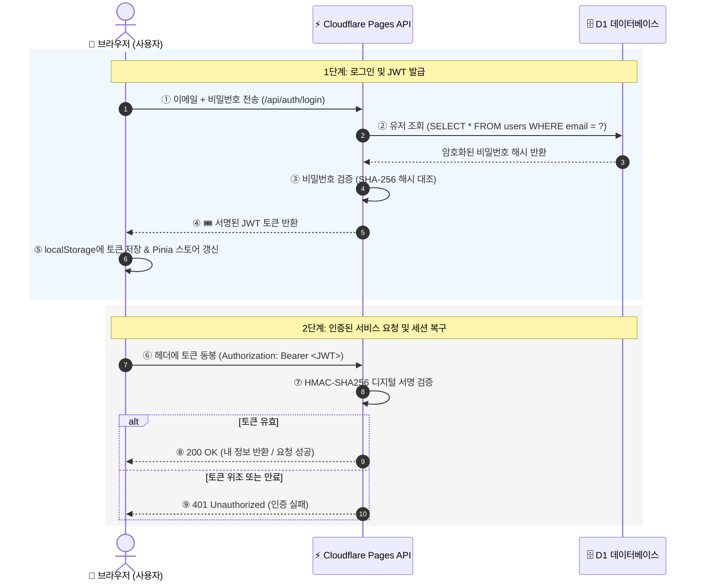

# 제5장: 인증 시스템 구현 — Cloudflare D1과 JWT 기반 로그인

> 🎉 이 장의 작은 성공: 모달에서 회원가입을 하면 D1에 암호화되어 저장되고, 로그인 즉시 상단 헤더에 "👋 홍길동님"과 [로그아웃] 버튼이 활성화된다! 새로고침해도 로그인이 유지된다!

3장과 4장을 통해 우리 앱은 타입 안전성(TypeScript), 초고속 로딩과 검색 최적화(Vite-SSG & SEO)를 갖추었습니다. 이제 진짜 상용 서비스의 핵심인 **인증 시스템(회원가입, 로그인, 세션 유지)**을 구현할 차례입니다.

---

## 0. 핵심 개념 먼저: JWT와 Web Crypto

코드를 작성하기 전에 JWT가 왜 필요하고, Cloudflare 서버리스 환경에서 어떻게 동작하는지 큰 그림을 이해합니다.

### 로그인이란 결국 무엇인가?

웹 서비스에 로그인을 한다는 것은, **"나 이 사람이야"라는 사실을 서버에 증명하는 것**입니다. 그런데 웹의 기본 통신 규약인 HTTP는 **기억이 없습니다(Stateless).** 방금 전에 로그인 요청을 보낸 사용자와 1초 뒤에 예약 요청을 보낸 사용자가 같은 사람인지 서버는 자동으로 알지 못합니다.

이 문제를 해결하는 전통적인 방식이 **세션(Session)**이었습니다:

- 사용자가 로그인 → 서버가 메모리(또는 세션 DB)의 "접속자 장부"에 기록 → 브라우저에 번호표(세션 ID 쿠키) 발급
- 이후 요청마다 브라우저가 번호표 제시 → 서버가 장부에서 대조 확인

하지만 Cloudflare Pages Functions 같은 **서버리스/엣지(Edge) 환경**에서는 전 세계 300개 이상의 데이터 센터 중 사용자와 가장 가까운 곳의 서버가 요청을 그때그때 처리하고 바로 꺼집니다. 서버가 한곳에 고정되어 메모리 장부를 들고 있을 수 없는 구조입니다.

이 문제를 우아하게 해결한 것이 바로 **JWT(JSON Web Token)**입니다.

### JWT — 위조 불가능한 디지털 신분증

JWT를 한 마디로 표현하면 **"서버가 직접 디지털 도장을 찍어준 모바일 신분증"**입니다.


**💡 여권에 비유하면**

- **여권 발급**: 로그인 성공 시 서버가 `{ id: 1, email: "user@test.com", name: "홍길동" }` 정보를 담은 신분증에 **서버만의 비밀 키(도장)**로 전자서명을 찍어 발급합니다.
- **여권 소지**: 브라우저가 이 신분증(JWT 문자열)을 안전하게 보관합니다(`localStorage`).
- **여권 제시**: 이후 서버에 요청을 보낼 때마다 HTTP 헤더(`Authorization: Bearer <토큰>`)에 신분증을 동봉합니다.
- **여권 확인**: 서버는 중앙 장부를 뒤질 필요가 없습니다. 신분증의 도장(서명)이 진짜인지만 수학적으로 검증합니다. 도장이 맞으면 통과, 위조되었거나 유효기간이 지났으면 즉시 거절합니다.
  



### JWT 토큰의 3단 구조

실제 발급되는 JWT 토큰은 다음과 같이 생겼습니다:

```
eyJhbGciOiJIUzI1NiIsInR5cCI6IkpXVCJ9.eyJpZCI6MSwiZW1haWwiOiJ1c2VyQGV4YW1wbGUuY29tIiwibmFtZSI6Iu2Zjeq4uOuPmSIsImV4cCI6MTc5MDk4...
```

점(`.`)으로 구분된 세 덩어리로 이루어져 있습니다:

| 파트    | 이름          | 내용                                                             | 특징                                   |
| :------ | :------------ | :--------------------------------------------------------------- | :------------------------------------- |
| **1단** | **Header**    | 암호화 알고리즘 정보 (`{"alg": "HS256", "typ": "JWT"}`)          | Base64Url 인코딩                       |
| **2단** | **Payload**   | 사용자 정보와 만료일 (`{"id": 1, "name": "홍길동", "exp": ...}`) | Base64Url 인코딩 (누구나 디코딩 가능!) |
| **3단** | **Signature** | 서버 비밀키(`JWT_SECRET`)로 1단+2단을 합쳐 서명한 값             | 위변조 방지 핵심                       |


**⚠️ Payload는 '암호화'가 아닙니다!**

Payload는 단순히 텍스트를 읽기 편하게 Base64 코드화 포맷으로 감싼 것일 뿐입니다. 누구나 [jwt.io](https://jwt.io) 같은 웹사이트에 붙여넣으면 유저 이름과 이메일을 바로 읽을 수 있습니다. 따라서 비밀번호나 주민번호 같은 민감한 정보는 절대 Payload에 담지 않습니다.


### 비밀번호 해싱이란?

JWT와 함께 알아야 할 개념이 **비밀번호 해싱**입니다.

DB에 비밀번호를 그대로(`1234qwer`) 저장하면, DB가 해킹당했을 때 모든 사용자의 비밀번호가 그대로 유출됩니다. 이를 막기 위해 **해시(Hash) 함수**로 비밀번호를 변환해서 저장합니다.

```
원본 비밀번호:  "1234qwer"
            ↓ bcrypt 해시 함수 적용 (단방향 — 역산 불가)
저장되는 값:   "$2b$10$..." (알아볼 수 없는 문자열)
```

- **단방향**: 해시 값으로 원본 비밀번호를 역산할 수 없습니다.
- **검증 방식**: 로그인 시 입력한 비밀번호를 같은 방식으로 해싱해서 DB의 해시값과 비교합니다.

---

## 1. 사전 준비: Wrangler CLI 설치

D1 데이터베이스에 SQL(테이블 생성 등)을 직접 실행하려면 **Wrangler**가 필요합니다. Wrangler는 Cloudflare가 제공하는 공식 CLI(명령줄 도구)로, 로컬 IDE에서 Cloudflare 서비스를 제어하는 역할을 합니다.

1권에서는 Cloudflare 대시보드 웹 사이트에 직접 로그인해서 D1 테이블을 만들었습니다. 2권부터는 Wrangler를 설치해두면 Antigravity IDE의 터미널에서 바로 실행할 수 있습니다.

> 💬 "이 프로젝트에 Wrangler CLI를 개발 의존성으로 설치해줘. 그리고 로컬에서 Cloudflare 계정에 로그인하는 방법도 알려줘."

AI가 다음 명령을 실행해 줍니다:

```bash
npm install -D wrangler
npx wrangler login   # 브라우저가 열리고 Cloudflare 계정으로 인증
```


**💡 `npm install -D wrangler`의 의미**

- `npm install` — 패키지 설치
- `-D` — "개발 전용(devDependency)"으로 설치. 실제 배포 번들에는 포함되지 않고, 개발 작업에만 사용하는 도구임을 의미합니다.
- `wrangler` — Cloudflare CLI 도구 이름

`npx wrangler login` 이후 브라우저 창이 열리면 Cloudflare 계정으로 로그인합니다. 1권에서 만든 계정을 그대로 사용하면 됩니다.


## 2. 프롬프팅: D1을 재활용한 커스텀 인증 적용하기

새로운 외부 서비스(Supabase 등)를 배우는 대신, 1권에서 이미 익숙해진 Cloudflare D1(SQLite)을 확장합니다. D1에 유저 테이블 하나를 추가하는 것으로 인증 시스템의 DB 준비가 끝납니다.

> 💬 "기존 Cloudflare D1 데이터베이스에 유저(Users) 테이블을 추가하는 SQL 마이그레이션 파일을 만들어줘. 비밀번호는 해싱해서 저장하고, 로그인 성공 시 JWT 토큰을 발급하는 API(Pages Functions)를 만들어줘. 프론트엔드에는 회원가입과 로그인 폼 컴포넌트도 만들어."

AI가 생성하는 파일들:

- `migrations/0001_create_users.sql` — D1에 실행할 SQL
- `functions/api/auth/login.js` — 로그인 API
- `functions/api/auth/signup.js` — 회원가입 API
- `functions/api/auth/me.js` — 로그인 확인 API
- `functions/api/auth/_util.js` — 공통 유틸 함수
- `src/components/AuthModal.vue` — 회원가입과 로그인 폼 컴포넌트

생성된 SQL 마이그레이션 파일을 열어 확인합니다:

```sql
-- migrations/0001_create_users.sql
CREATE TABLE IF NOT EXISTS users (
  id INTEGER PRIMARY KEY AUTOINCREMENT,
  email TEXT NOT NULL UNIQUE,
  password_hash TEXT NOT NULL,
  name TEXT NOT NULL,
  role TEXT DEFAULT 'user',
  created_at DATETIME DEFAULT CURRENT_TIMESTAMP
);
```

파일이 만들어졌다고 바로 D1에 적용되지는 않습니다. 이 SQL을 **실제 Cloudflare D1에 실행**해야 합니다. AI에게 이어서 요청합니다:

> 💬 "방금 만든 마이그레이션 파일을 Wrangler로 D1에 실제 실행해줘."

AI가 Antigravity IDE 터미널에서 다음 명령을 실행합니다:

```bash
npx wrangler d1 execute <DB이름> --file=migrations/0001_create_users.sql
```

`<DB이름>`은 1권에서 만든 D1 데이터베이스 이름입니다. 명령 실행 후 Cloudflare 대시보드에서 `users` 테이블이 생성된 것을 확인할 수 있습니다.

---

## 3. 귀납적 코드 이해: 백엔드 인증 API

Cloudflare Pages Functions는 Node.js가 아닌 가볍고 빠른 **Edge V8 런타임**에서 동작합니다. 이 말은 곧, Node.js에서 흔히 쓰는 `bcrypt`나 `jsonwebtoken` 같은 무거운 패키지를 사용할 수 없다는 뜻입니다.

대신 브라우저와 Cloudflare가 함께 표준으로 지원하는 **Web Crypto API(`crypto.subtle`)**를 사용합니다. 외부 라이브러리 하나 없이 순수 웹 표준만으로 보안 암호화를 구현하는 것입니다.

생성된 파일 중 `functions/api/auth/_utils.js`를 열어봅니다. 인증 시스템 전체에서 반복 사용하는 세 가지 핵심 도구가 담겨 있습니다.

### 3-1. 비밀번호 해싱 — `hashPassword()`

```javascript
// functions/api/auth/_utils.js 발췌
export async function hashPassword(password) {
  const data = encoder.encode(password + ":samarkand_salt"); // ①
  const hashBuffer = await crypto.subtle.digest("SHA-256", data); // ②
  // ... (16진수 문자열로 변환)
}
```

코드를 순서대로 읽으면:

- **① `+ ":samarkand_salt"`**: 비밀번호 뒤에 서비스 고유 문자열(Salt)을 덧붙입니다. 만약 두 사람이 같은 비밀번호 `"1234"`를 쓰더라도, Salt 덕분에 DB에 저장되는 해시값이 달라집니다. 해커가 미리 만들어둔 "흔한 비밀번호 해시 목록(레인보우 테이블)"으로 공격하는 것을 막는 핵심 기법입니다.
- **② `crypto.subtle.digest("SHA-256", data)`**: 웹 표준 SHA-256 알고리즘으로 단방향 해시를 생성합니다. 결과는 항상 고정된 길이의 알아볼 수 없는 문자열이 됩니다. 역산이 수학적으로 불가능합니다.

### 3-2. JWT 서명 생성 — `signJwt()`

```javascript
// functions/api/auth/_utils.js 발췌
export async function signJwt(payload, secret = JWT_SECRET) {
  const expPayload = {
    ...payload,
    exp: Math.floor(Date.now() / 1000) + 7 * 24 * 60 * 60, // ① 7일 후 만료
  };
  // ② Header + Payload를 합쳐서 비밀 키로 HMAC-SHA256 서명
  const key = await crypto.subtle.importKey(
    "raw",
    encode(secret),
    { name: "HMAC", hash: "SHA-256" },
    false,
    ["sign"],
  );
  // ③ "Header.Payload.Signature" 형태로 반환
  return `${encodedHeader}.${encodedPayload}.${encodedSignature}`;
}
```

- **① `exp: ... + 7 * 24 * 60 * 60`**: 토큰의 만료 시각(Unix 타임스탬프)을 현재 시각 기준 7일 뒤로 지정합니다. 7일이 지난 토큰으로 요청을 보내면 서버가 자동으로 거절합니다. 분실된 토큰이 영구적으로 악용되는 것을 막는 장치입니다.
- **② `crypto.subtle.importKey` + `crypto.subtle.sign`**: 비밀 키(`JWT_SECRET`)를 이용해 Header와 Payload를 합친 문자열에 디지털 서명을 생성합니다. 이 서명은 서버만이 만들 수 있으므로, 누군가 Payload를 변조하면 서명이 깨져서 즉시 탐지됩니다.
- **③ `"Header.Payload.Signature"` 형태**: 앞서 배운 JWT 3단 구조 그대로입니다. 개념과 코드가 1:1로 대응됩니다.

### 3-3. 회원가입 API — 흐름 중심으로 읽기 (`signup.js`)

```javascript
// functions/api/auth/signup.js 핵심 흐름
export async function onRequestPost(context) {
  const { email, password, name } = await request.json();

  // ① 이메일 중복 검사
  const existing = await env.DB.prepare("SELECT id FROM users WHERE email = ?")
    .bind(email)
    .first();
  if (existing) return Response(401); // "이미 등록된 이메일"

  // ② 비밀번호 해싱 후 저장
  const hashedPassword = await hashPassword(password);
  await env.DB.prepare(
    "INSERT INTO users (email, password_hash, name) VALUES (?, ?, ?)",
  )
    .bind(email, hashedPassword, name)
    .run();

  // ③ 가입 즉시 JWT 발급 (별도 로그인 불필요)
  const token = await signJwt({ id, email, name });
  return Response({ success: true, token, user });
}
```

세 단계가 명확합니다:

- **①** 같은 이메일로 가입한 사람이 있는지 먼저 확인합니다. 있으면 `409 Conflict`를 반환합니다.
- **②** 비밀번호를 절대 평문으로 저장하지 않습니다. `hashPassword()`를 거친 해시값만 `password_hash` 컬럼에 저장됩니다.
- **③** 가입이 성공하면 바로 로그인된 상태로 만들어줍니다. 사용자가 가입 직후 또 로그인 폼을 채워야 하는 번거로움을 없애는 UX 배려입니다.

### 3-4. 로그인 API — 핵심 2줄 (`login.js`)

```javascript
// functions/api/auth/login.js 핵심 흐름
const hashedPassword = await hashPassword(password); // ① 입력값을 동일하게 해싱

const user = await env.DB.prepare(
  "SELECT id, email, name FROM users WHERE email = ? AND password_hash = ?", // ②
)
  .bind(email, hashedPassword)
  .first();

if (!user) return Response(401); // "이메일 또는 비밀번호 불일치"

const token = await signJwt(user); // ③ JWT 발급
```

로그인의 핵심 아이디어는 단순합니다:

- **① 동일한 해시 함수 적용**: DB에는 원본 비밀번호가 없습니다. 그래서 사용자가 입력한 비밀번호를 가입 때와 **똑같은 방식으로 해싱**해서 비교합니다. `"1234" → hashPassword() → "a9b3c..."`, 이 값이 DB의 `password_hash`와 일치하면 맞는 비밀번호입니다.
- **② `WHERE email = ? AND password_hash = ?`**: 이메일과 해시된 비밀번호 두 가지를 동시에 만족하는 유저를 찾습니다. 결과가 없으면 이메일이 없거나 비밀번호가 틀린 것입니다.
- **③** 일치 확인 후 JWT를 발급합니다. 이 토큰이 브라우저에게 전달되어 이후 모든 인증 요청에 사용됩니다.


**💡 서버는 아무것도 기억하지 않습니다**

로그인 API는 JWT를 발급하고 나서 아무것도 저장하지 않습니다. 세션 DB도, 접속자 목록도 없습니다. "이 토큰이 유효한지" 판단하는 모든 정보가 토큰 자체에 담겨 있기 때문입니다. 다음 요청이 오면 서버는 토큰을 꺼내 서명만 검증하고, 맞으면 `{ id, email, name }`을 꺼내 씁니다. 이것이 JWT의 핵심 가치, **Stateless 인증**입니다.


---

## 4. 귀납적 코드 이해: Pinia 전역 스토어 (`src/stores/auth.ts`)

로그인 여부를 여러 컴포넌트에서 확인해야 합니다. 헤더에서는 "로그인/로그아웃" 버튼을, 예약 페이지에서는 유저 이름을 표시해야 합니다. 이 정보를 모든 컴포넌트가 공유하려면 전역 상태 관리가 필요합니다.

> 💬 "로그인 상태(토큰, 유저 이름)를 Pinia 스토어로 관리해줘. 로그인하면 스토어에 저장하고, 로그아웃하면 스토어와 localStorage를 모두 비워줘."


**💡 `localStorage`란?**

브라우저가 제공하는 작은 저장공간입니다. 페이지를 새로고침해도 사라지지 않아서 JWT 토큰을 보관하는 용도로 많이 사용합니다. `localStorage.getItem('auth_token')`은 저장된 토큰을 꺼내오는 코드, `localStorage.setItem('auth_token', token)`은 토큰을 저장하는 코드입니다.


AI가 생성한 `src/stores/auth.ts`를 열어 `defineStore`의 구조를 파악합니다. Pinia는 Vue 공식 상태 관리 라이브러리로, 여러 컴포넌트가 같은 데이터를 바라보는 '단일 진실 공급원(Single Source of Truth)' 역할을 합니다.


**💡 Pinia란? — 앱 전체의 공용 냉장고**

2장에서 배운 `ref()`는 하나의 컴포넌트 안에서만 데이터를 관리합니다. 그런데 "로그인 상태"는 헤더, 예약 페이지, 마이페이지 등 여러 곳에서 동시에 알아야 합니다.

Pinia는 **앱 전체가 공유하는 냉장고**입니다. 어떤 컴포넌트에서든 같은 냉장고에서 데이터를 꺼내 쓸 수 있고, 한 곳에서 값을 바꾸면 모든 곳에 자동으로 반영됩니다.


`src/stores/auth.ts`를 세 파트로 나눠 읽으면 구조가 한눈에 들어옵니다.

**① State: 저장할 데이터**

```typescript
// 앱이 기억해야 할 두 가지
const token = ref<string | null>(localStorage.getItem("auth_token")); // ← 앱 시작 시 즉시 복원
const user = ref<User | null>(null);
```

`token`은 앱이 처음 켜질 때 `localStorage`에서 바로 읽어옵니다. 브라우저를 새로고침(`F5`)해도 Pinia가 토큰을 잃지 않는 이유가 바로 이 한 줄입니다. `user`는 서버에 확인 후 채워집니다.

**② Getters: State에서 파생되는 계산값**

```typescript
const isAuthenticated = computed(() => !!token.value && !!user.value);
const userName = computed(() => user.value?.name || "");
```

- `isAuthenticated`: 토큰도 있고 유저 정보도 있을 때만 `true`. 헤더에서 "👋 홍길동님" 표시 여부를 이 값 하나로 결정합니다.
- `!!` 앞에 느낌표 두 개: `null`이나 빈 문자열을 `false`로, 값이 있으면 `true`로 변환하는 간단한 트릭입니다.

**③ Actions: 상태를 바꾸는 함수들**

```typescript
function setAuth(newToken: string, newUser: User) {
  token.value = newToken;
  user.value = newUser;
  localStorage.setItem("auth_token", newToken); // ← 브라우저에도 영구 저장
}

function logout() {
  token.value = null;
  user.value = null;
  localStorage.removeItem("auth_token"); // ← 브라우저에서도 제거
}
```

`setAuth()`와 `logout()`이 Pinia 스토어와 `localStorage`를 항상 동시에 업데이트합니다. 이 두 곳의 상태가 항상 동기화되어야 새로고침 후에도 로그인이 유지됩니다.

**④ `initAuth()`: 새로고침 시 세션 복구**

```typescript
async function initAuth() {
  const storedToken = localStorage.getItem("auth_token"); // ① 토큰 꺼내기
  if (!storedToken) return; // 없으면 비로그인 상태 유지

  token.value = storedToken; // ② 일단 토큰 복원

  // ③ 서버에 "이 토큰 아직 유효해?" 확인
  const res = await fetch("/api/auth/me", {
    headers: { Authorization: `Bearer ${storedToken}` },
  });
  if (res.ok) {
    user.value = data.user; // 유효하면 유저 정보 복원 → 로그인 상태 완성!
  } else {
    logout(); // 만료됐거나 위조된 토큰이면 강제 로그아웃
  }
}
```

`initAuth()`의 역할이 중요합니다. `localStorage`에 토큰이 있다고 무조건 로그인 상태로 보면 안 됩니다 — 7일이 지나 만료됐을 수도 있거든요. 그래서 `/api/auth/me` 서버 엔드포인트에 한 번 더 확인 요청을 보내서, **유효한 토큰일 때만 로그인 상태를 복구**합니다.

### `main.ts`에 Pinia 등록

Pinia 스토어를 앱 전역에서 쓰려면 `createApp()` 직후 플러그인으로 장착합니다:

```typescript
// src/main.ts
const app = createApp(App);
const pinia = createPinia();

app.use(pinia); // ← 이 한 줄로 모든 컴포넌트에서 useAuthStore() 사용 가능
app.mount("#app");
```

---

## 5. 귀납적 코드 이해: UI와 스토어 연결

백엔드와 Pinia가 준비됐으니 사용자 화면과 연결합니다.

### 5-1. 일체형 탭 모달 (`src/components/AuthModal.vue`)

로그인과 회원가입 폼을 따로 페이지로 만들지 않고, 탭 하나로 전환되는 모달 안에 모두 담았습니다.

```vue
<!-- 탭 상태 관리 -->
const mode = ref<"login" | "signup">("login"); // "login" 또는 "signup" 둘 중
하나
```

`mode`가 `"login"`이면 이메일+비밀번호 두 칸짜리 폼이, `"signup"`이면 이름 칸이 추가된 세 칸짜리 폼이 나타납니다. 폼을 두 개 만드는 대신 한 폼을 조건부로 보여주는 패턴입니다.

```vue
<!-- 제출 시 mode에 따라 API 엔드포인트 자동 선택 -->
const endpoint = mode.value === "login" ? "/api/auth/login" :
"/api/auth/signup";
```

폼이 제출되면 `mode` 값에 따라 호출할 API를 자동으로 결정합니다. 로직 분기가 이 한 줄로 끝납니다.

```javascript
// 성공 시: Pinia에 저장 → 모달 닫기
authStore.setAuth(data.token, data.user); // ← 이 한 줄이 전부
emit("close");
```

서버에서 `{ token, user }`가 돌아오면 `authStore.setAuth()`를 호출합니다. 이 순간 Pinia 스토어가 갱신되면서, 이 스토어를 구독하는 **헤더(TopNavbar)까지 즉각 반응**합니다. 모달을 닫는 순간 헤더에 "👋 홍길동님"이 이미 표시되어 있습니다.

### 5-2. 헤더의 실시간 전환 (`src/components/TopNavbar.vue`)

```vue
<template v-if="authStore.isAuthenticated">
  <!-- ✅ 로그인 상태: 이름 + 로그아웃 버튼 -->
  <span>👋 {{ authStore.userName }}님</span>
  <button @click="authStore.logout()">로그아웃</button>
</template>

<template v-else>
  <!-- ❌ 비로그인 상태: 로그인/회원가입 버튼 -->
  <button @click="emit('open-auth-modal')">로그인 / 회원가입</button>
</template>
```

`v-if="authStore.isAuthenticated"` 한 줄이 헤더의 전체 전환을 담당합니다. `authStore.isAuthenticated`가 `false`이면 로그인 버튼이, `true`이면 유저 이름과 로그아웃 버튼이 나타납니다.

- **별도의 "화면 갱신" 코드가 없습니다**: Vue의 반응형 시스템이 Pinia 스토어의 변화를 감지해서 자동으로 화면을 다시 그려줍니다. 개발자는 그냥 "이 값이 true면 이걸 보여줘"만 선언하면 됩니다.
- **`authStore.logout()`**: 버튼 클릭 한 번으로 Pinia 스토어와 `localStorage`가 동시에 비워집니다.

### 5-3. 앱 시작 시 세션 복구 (`src/App.vue`)

```vue
<!-- src/App.vue -->
onMounted(() => { authStore.initAuth(); // ← 앱이 뜨는 순간 딱 한 번 실행 });
```

`onMounted`는 Vue 컴포넌트가 화면에 처음 그려진 직후 실행되는 훅(hook)입니다. 앱이 브라우저에 처음 로드될 때 `initAuth()`를 호출해서, `localStorage`에 저장된 토큰으로 로그인 상태를 복구합니다.

이 세 파일의 협력 덕분에 전체 인증 흐름이 완성됩니다:

```
회원가입/로그인 (AuthModal)
  → Pinia 스토어 갱신 (auth.ts)
    → 헤더 자동 전환 (TopNavbar)
      → 새로고침 후에도 복구 (App.vue onMounted)
```

---

## 마무리: 이 장에서 배운 것들

- **서버리스와 JWT**: 중앙 세션 저장소 없이도 디지털 서명(HMAC-SHA256)으로 요청을 안전하게 검증하는 Stateless 인증 원리
- **Web Crypto API**: Node.js 패키지 없이 `crypto.subtle`로 비밀번호 해싱과 JWT 서명을 순수 웹 표준으로 구현
- **Salt 기법**: 같은 비밀번호라도 해시값이 달라지게 만들어 레인보우 테이블 공격 방지
- **D1 마이그레이션**: `migrations/0001_create_users.sql`을 Wrangler CLI로 클라우드 DB에 직접 적용
- **Pinia Setup Store**: `ref`, `computed`, 일반 함수로 State·Getter·Action을 자연스럽게 나누는 Vue 3 전역 상태 관리
- **`initAuth()`**: 새로고침 후에도 로그인이 유지되는 세션 복구 패턴 — localStorage 토큰 → 서버 검증 → user 복원
- **AuthModal 탭 패턴**: `mode` ref 하나로 로그인/회원가입 폼 전환, 성공 시 Pinia 즉시 갱신 → 헤더 자동 반응

다음 6장에서는 로그인한 사용자가 사마르칸트 가이드의 일정을 확인하고 예약과 결제를 진행하는 **달력 UI 및 Stripe 결제 시스템**을 구현합니다.
