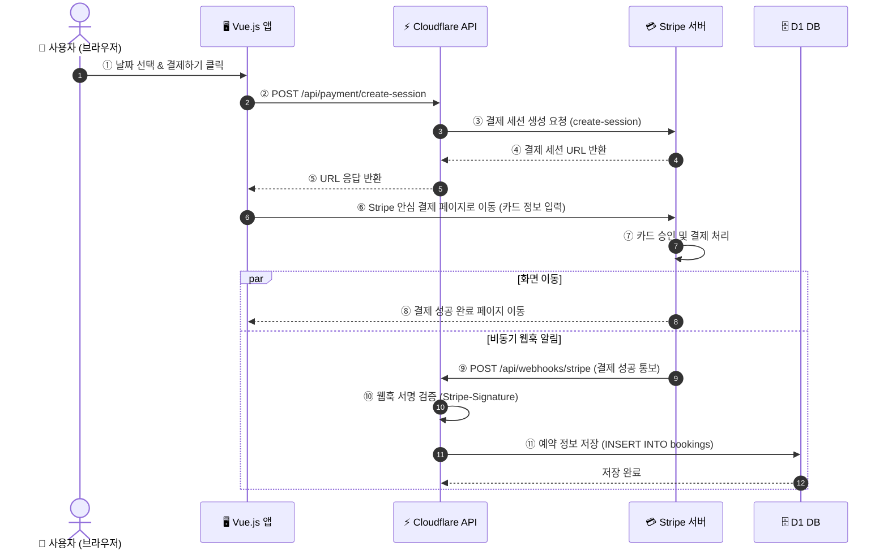
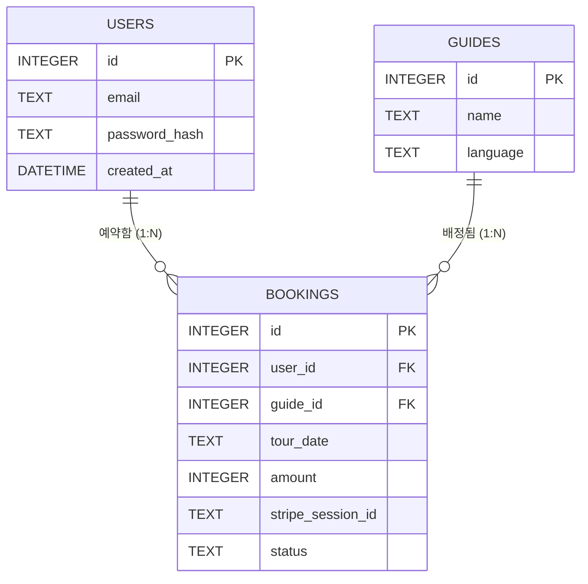

# 제5장: 예약과 결제 — 달력 UI, Stripe 연동, 웹훅 처리

> 🎉 이 장의 작은 성공: 달력에서 날짜를 고르고 Stripe 결제 버튼을 누르면 테스트 결제가 성공하고, DB에 예약이 기록된다!

## 0. 왜 Stripe인가? — 결제 서비스 선택의 이유

결제 기능을 직접 만드는 것은 매우 어렵습니다. 카드 정보를 안전하게 전송·저장하는 것만으로도 국제 보안 규격(PCI DSS) 인증이 필요하고, 카드사마다 다른 연동 방식을 개별로 구현해야 합니다. 그래서 실무에서는 이 모든 것을 대행해주는 **결제 대행사(PG사)**를 사용합니다.

### 왜 국내 PG 대신 Stripe를 선택했는가?

| | 국내 PG (토스페이먼츠, KCP 등) | Stripe |
|---|---|---|
| 사업자 등록 | **필수** (개인 사업자 이상) | 불필요 (테스트 환경에서 즉시 시작) |
| 연동 복잡도 | 높음 (공인인증 등 레거시 방식 혼재) | 낮음 (REST API 하나로 통일) |
| 해외 카드 결제 | 별도 계약 필요 | 기본 지원 |
| 개발자 문서 | 한국어 문서가 많음 | 영어이지만 매우 잘 정리됨, AI 번역 가능 |
| 포트폴리오 목적 | 사업자 없으면 실결제 불가 | 테스트 모드로 실제 흐름 완전 구현 가능 |

**결론**: 이 책의 목적인 **"사업자 없이 포트폴리오용 실제 결제 흐름 경험"**에는 Stripe가 압도적으로 유리합니다. 실제 서비스 출시 시에는 국내 PG로 전환하는 경우도 많지만, 개발 방식과 개념은 동일합니다.

### Stripe 수수료 구조

Stripe는 **결제가 일어날 때만** 수수료를 가져가는 방식입니다. 월 고정비가 없어 소규모 서비스에 유리합니다.

| 결제 유형 | 수수료 |
|---|---|
| 국내 카드 (한국 계정, 원화 결제) | 결제 금액의 **3.3%** + ₩ 고정 수수료 |
| 해외 카드 (국제 카드) | 결제 금액의 **3.9%** + 환전 수수료 |
| 테스트 모드 | **0원 (수수료 없음)** — 이 장에서 사용할 모드 |


**💡 이 장에서는 테스트 모드만 사용합니다**
Stripe 대시보드에서 **"Test mode"** 를 켜면 실제 카드를 등록하지 않아도 가상의 테스트 카드 번호(`4242 4242 4242 4242`)로 결제 전체 흐름을 경험할 수 있습니다. 수수료도 발생하지 않습니다. 실제 사용자에게 서비스를 오픈할 준비가 됐을 때만 "Live mode"로 전환하면 됩니다.


---

## 1. 사전 준비: bookings 테이블 마이그레이션

4장에서 `bookings` 테이블은 아직 없었습니다. 이 장에서 결제가 완료되면 예약 레코드를 DB에 저장해야 하므로, 먼저 테이블을 추가합니다. 4장에서 이미 Wrangler를 설치하고 Cloudflare 계정에 로그인한 상태이므로, 마이그레이션 파일 생성과 실행만 하면 됩니다.

> 💬 "`bookings` 테이블을 추가하는 D1 마이그레이션 SQL 파일을 만들어줘. 예약에는 유저 ID, 가이드 ID, 날짜, 결제 금액, Stripe 세션 ID, 예약 상태 필드가 필요해."

AI가 `migrations/0003_add_bookings.sql` 파일을 생성하면, 이어서 D1에 실행합니다:

> 💬 "방금 만든 마이그레이션 파일을 Wrangler로 D1에 실제 실행해줘."

AI가 터미널에서 실행합니다:
```bash
npx wrangler d1 execute <DB이름> --file=migrations/0003_add_bookings.sql
```

이제 예약 데이터를 저장할 공간이 준비되었습니다.

## 2. 프롬프팅: 달력 선택부터 결제까지 한 번에 지시하기
예약 시스템의 두 축인 **캘린더 UI**와 **결제 로직**을 하나의 프롬프트로 통합 지시합니다.

> 💬 "달력 컴포넌트를 추가해서 사용자가 투어 날짜를 선택할 수 있게 하고, 날짜를 고르면 Stripe 결제 팝업이 뜨도록 해줘. 결제 성공하면 D1 DB에 예약 레코드를 저장해."

AI가 이 지시를 처리하면서 생성하는 파일들:
- `src/components/BookingCalendar.vue` — 날짜 선택 컴포넌트
- `src/components/PaymentButton.vue` — Stripe 결제 버튼
- `functions/api/payment/create-session.ts` — Stripe Checkout Session 생성 API
- `functions/api/webhooks/stripe.ts` — 결제 완료 알림 처리 API

작업이 끝나면 먼저 **Stripe 대시보드**에서 테스트 API 키를 발급받아 Cloudflare의 환경변수에 등록하는 방법을 AI에게 물어봅니다.

> 💬 "Stripe 테스트 키를 Cloudflare Pages에 환경변수로 등록하고, 로컬 개발 환경에서도 `.dev.vars` 파일로 사용하는 방법을 알려줘."

## 3. 귀납적 코드 이해: 결제 흐름(Flow) 분석하기
AI가 작성한 결제 관련 코드를 따라가며 전체 흐름을 추적합니다.



이 흐름에서 가장 중요한 발견:
- **우리 서버에 카드 번호가 전혀 저장되지 않는다**: 카드 정보는 Stripe 서버에만 전달됩니다. 이 설계 덕분에 PCI DSS(결제 보안 규정) 준수 부담 없이 합법적으로 결제를 처리할 수 있습니다.
- **Stripe Session**: 우리 서버는 "어떤 금액의 결제를 요청한다"는 세션만 만들고, 실제 결제는 Stripe가 담당합니다.

## 4. 귀납적 코드 이해: 웹훅(Webhook) — Stripe가 먼저 전화를 건다
결제 완료 후 DB에 예약을 기록하기 위해 AI가 작성한 웹훅 API 코드를 분석합니다.

```typescript
// functions/api/webhooks/stripe.ts
export const onRequestPost: PagesFunction = async ({ request, env }) => {
  const signature = request.headers.get('Stripe-Signature')

  // 1. Stripe가 보낸 요청이 맞는지 서명 검증
  const event = stripe.webhooks.constructEvent(body, signature, env.STRIPE_WEBHOOK_SECRET)

  // 2. 결제 완료 이벤트만 처리
  if (event.type === 'checkout.session.completed') {
    const session = event.data.object
    const { guideId, userId, date } = session.metadata  // 우리가 넣어둔 예약 정보

    // 3. D1 DB에 예약 레코드 저장
    await env.DB.prepare('INSERT INTO bookings (...) VALUES (...)')
      .bind(guideId, userId, date).run()
  }

  return new Response('OK')
}
```

**핵심 개념 발견:**
- **Polling vs Webhook**: 결제가 완료됐는지 우리가 Stripe에 계속 물어보는(Polling) 것이 아니라, Stripe가 완료되는 순간 우리 서버를 직접 찌릅니다(Webhook). 이 역방향 통신 덕분에 실시간으로 결과를 처리할 수 있습니다.
- **서명 검증**: `stripe.webhooks.constructEvent`가 없으면 아무나 우리 웹훅 주소를 찔러서 가짜 결제 성공을 만들 수 있습니다. 이 한 줄이 보안의 핵심입니다.
- **metadata**: Stripe Session을 만들 때 예약 정보를 `metadata`에 넣어두면, 웹훅에서 다시 꺼내 쓸 수 있습니다.

## 5. 귀납적 코드 이해: DB 스키마 확장 — 관계형 DB 읽기
AI가 짜준 확장된 SQL 스키마를 봅니다.

```sql
-- 기존 1권의 테이블
CREATE TABLE tour_preferences (...);

-- 새로 추가된 테이블들
CREATE TABLE bookings (
  id INTEGER PRIMARY KEY AUTOINCREMENT,
  user_id INTEGER NOT NULL REFERENCES users(id),    -- 어떤 유저의 예약인가
  guide_id INTEGER NOT NULL REFERENCES guides(id),  -- 어떤 가이드의 예약인가
  tour_date TEXT NOT NULL,
  amount INTEGER NOT NULL,                          -- 결제 금액(원)
  stripe_session_id TEXT UNIQUE,                    -- Stripe 결제 ID
  status TEXT DEFAULT 'pending',
  created_at DATETIME DEFAULT CURRENT_TIMESTAMP
);
```



- **`REFERENCES users(id)`**: 이것이 **Foreign Key(외래 키)**입니다. `bookings` 테이블의 `user_id`는 반드시 `users` 테이블에 존재하는 `id`여야 합니다. 존재하지 않는 유저의 예약을 DB에 넣으려 하면 오류가 납니다.
- **관계형 데이터**: 이제 `"userId=3인 유저의 모든 예약 내역과 해당 가이드 이름을 함께 조회해줘"`처럼 테이블 간의 조인(JOIN) 쿼리가 가능해집니다.

## 6. 프롬프팅 + 이해: 로컬 웹훅 테스트 — Stripe CLI
웹훅은 외부 서버(Stripe)가 우리 서버를 찌르는 방식이라, 로컬 개발 환경에서 테스트하기가 까다롭습니다.

> 💬 "Stripe CLI를 사용해서 로컬 개발 서버에서 웹훅을 테스트하는 방법을 알려줘."

AI가 `stripe listen --forward-to localhost:8788/api/webhooks/stripe` 명령어를 알려줍니다. Stripe CLI가 Stripe 서버와 우리 로컬 서버 사이를 중계해주기 때문에, 배포 없이도 결제 → 웹훅 전체 흐름을 테스트할 수 있습니다. 이 명령어의 원리를 이해하는 것이 로컬 개발의 핵심 노하우입니다.
